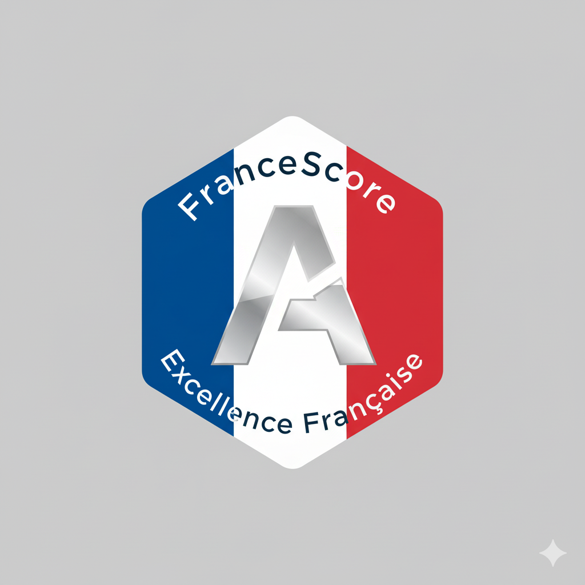
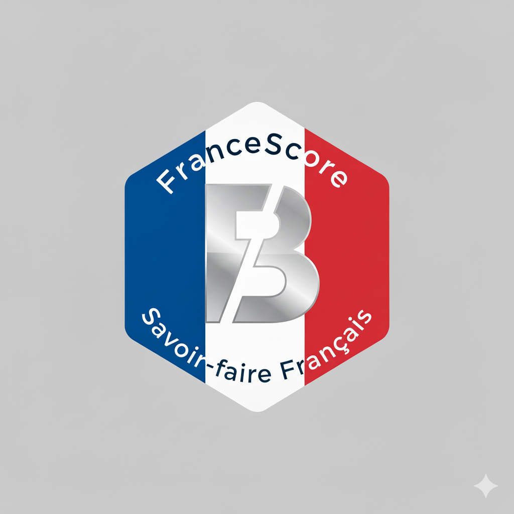
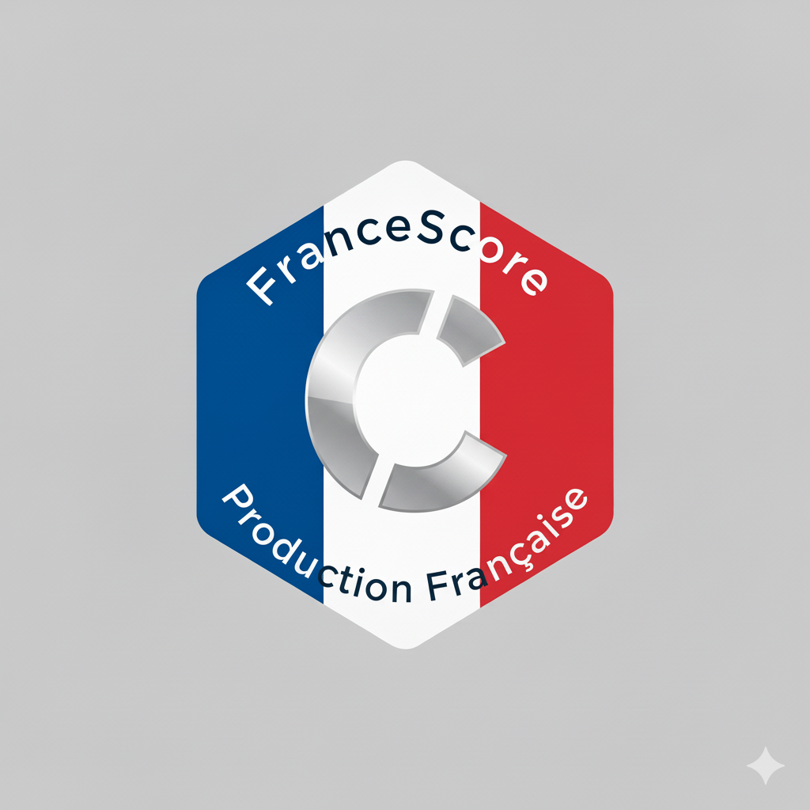

# MON P'TIT PROGRAMME 2027 - LE MANIFESTE DE LA RUPTURE LUCIDE

Une Refondation du Contrat Social pour une France Retrouvée.
***

***

## INTRODUCTION GÉNÉRALE - LE COURAGE DE LA VÉRITÉ
Françaises, Français, 

Nous vivons une époque charnière, un de ces moments rares dans l'histoire d'une nation où le destin hésite entre le déclin lent et le sursaut salvateur. En parcourant la France, en écoutant vos colères silencieuses et vos espoirs frustrés, j'ai acquis une conviction profonde : notre modèle ne fonctionne plus. Il ne s'agit pas ici de blâmer tel ou tel gouvernement, mais de faire le constat lucide d'un système à bout de souffle, sédimenté par quarante années de réformes paramétriques qui n'ont fait qu'ajouter de la complexité à l'inefficacité.

Aujourd'hui, notre pays est devenu un paradoxe vivant. Nous sommes champions du monde de la dépense publique et des prélèvements obligatoires, et pourtant, nos hôpitaux craquent, notre école dégringole dans les classements internationaux, et le sentiment d'injustice fiscale et sociale n'a jamais été aussi fort. Nous avons construit un État-providence obèse mais impuissant, une machine administrative qui consomme tant d'énergie pour se gérer elle-même qu'elle en oublie sa mission première : servir le citoyen.

Mon P'tit Programme 2027 (MPP2027) n'est pas une simple liste de promesses électorales destinées à satisfaire des clientèles. C'est une architecture. C'est une proposition de rupture systémique, un « Big Bang » nécessaire pour remettre la France à l'endroit. Cet essai, que vous tenez entre les mains, est le mode d'emploi de cette reconstruction. Il a été rédigé avec une triple exigence : la recherche de chiffrages crédible, l'empathie pour les vies derrière les statistiques, et la pédagogie pour que chaque citoyen comprenne où va son argent.

Notre philosophie repose sur un nouvel équilibre : le "Libéralisme-Dirigiste-Redistributionniste".
- Libéral, car nous croyons que la création de richesse passe par la libération des énergies productives et la baisse massive du coût du travail.
- Dirigiste, car l'État doit retrouver son rôle de stratège industriel, capable de lancer des projets de recherches ou de protéger nos frontières commerciales par une TVA stratégique.
- Redistributionniste, car nous ne laisserons personne au bord du chemin. Nous remplaçons l'assistanat conditionnel et stigmatisant par un investissement universel dans l'humain : **le Revenu de Droit Commun.**

Dans les pages qui suivent, nous allons décortiquer, pilier par pilier, cette nouvelle maison France. Nous parlerons sans tabou des plus de 350 milliards d'euros de réallocation budgétaire, de l'inflation transitoire nécessaire à notre compétitivité, et du nouveau pacte moral entre la Nation et ses citoyens. Nous comparerons notre offre avec celles des blocs politiques actuels pour démontrer pourquoi MPP2027 est la seule voie de cohérence.
Bienvenue dans le chantier du siècle. Bienvenue dans la réalité de 2027.

***

***
## CHAPITRE 1 : LE REVENU DE DROIT COMMUN (RDC)
Un Pacte de Confiance, un Socle pour l'Avenir
***
### Le Constat : La faillite de l'assistanat bureaucratique
Notre système de protection sociale est devenu un labyrinthe kafkaïen. RSA, Prime d'activité, APL, Allocations familiales, bourses sur critères sociaux... Chaque aide a été empilée sur la précédente, créant un maquis illisible de conditions de ressources, d'effets de seuil et de démarches humiliantes.
Le résultat de cette complexité est doublement désastreux :
Le Non-Recours Massif : Des millions de Français, pourtant éligibles, ne demandent rien. Découragés par la complexité administrative, par la honte de devoir justifier leur pauvreté, ou par peur de la stigmatisation, ils restent hors du système. C'est une faillite morale de la République.
La Trappe à Inactivité : Plus grave encore pour notre économie, le système actuel désincite au travail. Le RSA étant dégressif (on vous retire de l'aide dès que vous gagnez un euro), la reprise d'un emploi à temps partiel ou mal rémunéré se traduit souvent par une stagnation, voire une baisse du revenu disponible une fois déduits les frais de transport et de garde. Nous avons créé un système où l'inactivité est parfois plus rationnelle économiquement que l'effort.
Avec MPP2027, nous changeons radicalement de logique. Nous passons d'une logique de guichet (demander, justifier, attendre) à une logique de droit (automatique, universel, immédiat). Nous ne proposons pas une allocation de survie, mais un investissement dans le capital humain. Nous construisons le « Rez-de-Chaussée » de la maison France : un sol ferme en dessous duquel aucun citoyen ne doit tomber.

***
### 🧱 pilier 1 : Le Socle Universel (Le "Rez-de-Chaussée")

Le Revenu de Droit Commun (RDC) est la pierre angulaire de notre projet. Ce n'est pas un revenu universel inconditionnel naïf qui permettrait de vivre sans travailler, mais un socle de citoyenneté économique qui complète les revenus du travail et remplace le maquis des aides existantes. **Ce RDC est un revenu supplémentaire imposable**

- **Pour l'Adulte Actif : 450 € nets par mois.** Chaque adulte résidant fiscalement en France, âgé de plus de 18 ans, se voit attribuer un socle inconditionnel de 450 € nets par mois. Ce montant n'est pas une allocation de subsistance destinée à remplacer le travail, mais un socle de sécurité sur lequel construire. La révolution réside dans le mécanisme du Cumul Intégral. Contrairement au RSA qui est dégressif, le RDC s'additionne intégralement aux revenus d'activité. Chaque euro gagné par le travail est un euro supplémentaire dans la poche du citoyen. Il n'y a plus de « taxe marginale » implicite sur la reprise d'activité.
- **Pour l'Enfant : 325 € nets par mois.** 
Le système actuel du Quotient Familial (QF) est une anomalie redistributive. En réduisant l'impôt des familles nombreuses aisées, il subventionne davantage les enfants de “riches” que les enfants de “pauvres”. Un enfant de cadre supérieur génère une économie d'impôt pouvant atteindre 1 791 € par an (plafond de la demi-part), tandis qu'un enfant de famille non-imposable ne rapporte rien en termes fiscaux. MPP 2027 abolit ce système inéquitable en supprimant le QF (demi-part) pour le remplacer par une logique forfaitaire universelle.
- **Pour le Retraité : 150 € nets par mois.** Ce complément s'ajoute aux pensions. Il n'est pas choisi au hasard. Il est calibré pour compenser mathématiquement la hausse de la TVA (passage à 26%) la suppression de l’abattement de 10 % et l'augmentation des taux d’imposition décrit dans notre volet fiscal. C'est une mesure de protection sociale qui prévient la paupérisation du grand âge.

***
### 📜 pilier 2 : Le Contrat Républicain (Des Droits et des Devoirs)
Contrairement à l'idée d'un revenu inconditionnel naïf, le RDC est un Pacte. Il se mérite par le respect de la communauté. Ce n'est pas de l'argent magique, c'est de la solidarité conditionnelle.
- **Un Revenu Imposable :** Le RDC est un revenu, il s'ajoute donc à vos autres ressources pour le calcul de l'impôt. Chacun contribue ainsi à l'effort national selon ses moyens réels.
- **La Justice avant tout :** Celui qui brise le pacte social par la délinquance ou le crime verra son RDC suspendu a minima le temps d'écrou (modalités définies au CHAPITRE Justice). La solidarité ne finance pas ceux qui nuisent à la société.
- **L'Assimilation par la Dignité (Égalité stricte) :** Nous refusons l'hypocrisie qui consiste à accueillir des étrangers légalement pour ensuite les précariser. Conformément à nos principes constitutionnels et pour garantir une assimilation rapide, le RDC sera accessible à tout étranger en situation régulière, disposant d'un titre de séjour valide, aux mêmes conditions que les citoyens français. La Contrepartie (Le filtre à l'entrée) : Cette égalité sociale totale implique une exigence accrue en amont. Si la solidarité est immédiate, l'obtention du titre de séjour, elle, fera l'objet d'un durcissement drastique et d'une sélection rigoureuse (voir Chapitre 5 : Immigration). Nous déplaçons la fermeté : nous serons intraitables sur qui entre et reste, mais irréprochables avec ceux que nous choisissons d'accueillir.
***
### ⚖️ pilier 3 : La Justice Ciblée (Protéger les plus fragiles)
L'universalité n'empêche pas de reconnaître les difficultés spécifiques. Le "Droit Commun" s'adapte aux accidents de la vie pour garantir la dignité.
- **Handicap & Dépendance : 1 200 € garantis (1033 € actuellement).** Pour les personnes handicapées dépendantes qui ne peuvent pas travailler, le RDC est complété par une aide spécifique pouvant atteindre 750 € pour un total de 1200 nets par mois.
- **L'Autonomie Étudiante (RUE) : 750 € par mois.** Pour mettre fin à la précarité étudiante, nous remplaçons les bourses par un RDC Étudiant de 750 €/mois (dès la première année et pour les années validées), permettant de se consacrer pleinement aux études. Une baisse à 650 € est prévu pour les redoublants et retrouvera sa valeur initiale une fois l'année validée.
- **Soutien au Parent Isolé : +300 € par mois.** Parce qu'élever seul un enfant est un défi, un complément spécifique sera versé aux foyers monoparentaux.

***
### 🚀 pilier 4 : Le Travail Payant et la Garantie "Zéro Perdant"
Notre philosophie est claire : **le travail doit toujours payer plus que l'inactivité.**
- **Cumul Intégral :** Contrairement au RSA qui est dégressif, chaque euro gagné par votre travail s'ajoute à votre RDC. Travailler enrichit toujours.
- **Garantie Zéro Perdant :** Nous savons que la transition inquiète et que des cas isolés et non-prévu peuvent se présenter. Pour palier a ces aléas, nous mettons en place un mécanisme de compensation automatique plafonné (jusqu'à 500€ de complément si nécessaire) pour assurer qu'au moment de la bascule, aucun Français ne touche moins qu'avant la réforme, nottament avec la suppression de APL. C'est un mécanisme transitoire d'urgence de 12 Milliards d'€. Il ne s'agit pas de gérer des dossiers complexes éternellement, mais de geler les droits acquis au moment de la bascule et affiner par la suite ces aides de manière claire et automatique.
***
 ### 🏢 pilier 5 : La Révolution Administrative (Le Guichet Unique)
Le RDC permet un choc de simplification historique. Nous transformons l'État pour le rendre efficace.
- **Fusion CAF et autres caisses sociales / Impôts :** Fini la dispersion des dossiers. Un guichet unique centralisé pour les citoyens gère le versement du RDC et le prélèvement de l'impôt. Cette fusion n'est pas qu'un changement de logo. En passant d'une logique de 
contrôle a priori de millions de dossiers complexes (RSA, APL, Prime d'activité) à 
un versement automatique via les flux fiscaux, nous supprimons 80 % de la 
charge administrative de la branche Famille. 
Nous ne remplaçons pas 2 départs à la retraite sur 3 dans les fonctions de gestion (back-office) pour préserver les fonctions de contact humain. C'est la fin de la bureaucratie du formulaire qui finance une partie de la générosité du modèle.
- **La Fin de la Paperasse :** Le versement devient automatique ou quasi-automatique. Plus de recalculs trimestriels anxiogènes, plus de courriers perdus.

***
 
### 💰 pilier 6 : Un Financement Responsable et Transparent
Ce projet ambitieux (308 Milliards d'€) est intégralement financé sans creuser la dette, par une réallocation intelligente des ressources de la Nation.
- **Remplacement : 112 Md€** proviennent de la suppression des aides actuelles obsolètes.
- **Justice Fiscale : 75 Md€** proviennent de la suppression totale hors CIR des niches fiscales (détail dans le chapitre fiscalité). 
- **Lutte contre la Fraude : L'IA "e-Marianne" et la simplification** du système nous permettront de récupérer une part significative de la fraude fiscale et sociale.(entre 10 et 20 Md€)
- **Effort Partagé : Le surplus de recettes de la TVA Stratégique (20 Md€) et l'élargissement de l'assiette de l'impôt (60 Md€)** 
- **Économies : En supprimant la gestion complexe de milliers de règles et en rationalisant les structures**, nous économisons massivement sur les dépenses fonctionnelles de l'État : **20 Md€** 

***

### Tableau récapitulatif

| Catégorie                      | Montant Mensuel (€) | Coût Total (Mds €) |
|:-------------------------------| :---: |:------------------:|
| Adulte Actif                   | 450 |       168,48       |
| Enfant                         | 325 |       58,50        |
| Retraité                       | 150 |       30,60        |
| Étudiant (RUE)                 | 750 |       21,87        |
| Parent Isolé                   | 300 |        6,12        |
| Personne Handicapée Dépendante | 750 |       10,80        |
| Garantie Zéro Perdant          | |       12,00        | 
| **TOTAL**                      | |     **308,37**     |

***

### Analyse Comparative des Blocs Politiques

| Thème | MPP 2027 | Bloc Central | Bloc de Gauche (NFP) | Bloc National (RN) |
| :--- | :--- | :--- | :--- | :--- |
| **Philosophie** | Universalité & Responsabilité | Incitation complexe & Stabilité | Lutte contre la pauvreté & Assistanat | Priorité Nationale & Exclusion |
| **Mécanisme** | Socle automatique + Cumul intégral | Prime d'activité (complexe, non-recours) | Extension du RSA (jeunes), conditionnel | Réservation des aides aux Français |
| **Famille** | Forfaitaire (325€/enfant) = Égalité | Quotient Familial (favorise les riches) | Allocations dès le 1er enfant | Parts fiscales pleines dès le 2ème enfant |
| **Jeunesse** | Autonomie (750€) pour tous | Bourses sur critères sociaux | Garantie d'autonomie | Prêts garantis / Exonérations |

### **Analyse Critique :**

- Le Bloc Central s'accroche à un système de "solidarité à la source" qui reste d'une complexité effrayante et ne résout pas les effets de seuil.
- Le NFP propose une générosité accrue mais financée par l'impôt sur les plus riches, sans mécanisme fort d'incitation à la reprise d'emploi (risque de trappe à pauvreté).
- Le RN fonde son modèle sur l'exclusion des étrangers ("Préférence Nationale"), ce qui est constitutionnellement fragile, et propose une politique nataliste classique via les parts fiscales.
- MPP 2027 est le seul à proposer une refonte totale qui supprime la bureaucratie (fusion CAF/Impôts) et fait du travail le seul vecteur d'enrichissement (cumul intégral).

***
### Conclusion : Le RDC, ou le Capital de Liberté
Le Revenu de Droit Commun ne marque pas seulement une réforme paramétrique de plus ; il acte un changement de civilisation. Jusqu'ici, notre modèle social était construit sur la peur : la peur de manquer pour le bénéficiaire, et la peur d'être "dupé" pour le contributeur. En conditionnant la survie à des démarches bureaucratiques humiliantes et en reprenant d'une main ce que le travail rapportait de l'autre, nous avions enfermé les plus fragiles dans une trappe mathématique absurde. 

Avec le RDC, nous brisons ce plafond de verre.
En instaurant le Cumul Intégral, nous abolissons la « taxe sur la pauvreté » qui frappait celui qui osait reprendre un emploi. Désormais, le travail ne sert plus à rembourser une allocation, il sert exclusivement à s'enrichir.

Ce socle de 450 € n'est donc pas une rente d'oisiveté, c'est un plancher de sécurité. C'est le capital de départ qui permet à l'étudiant de se concentrer sur ses études, à l'entrepreneur de prendre un risque, et au salarié modeste de refuser l'inacceptable pour mieux négocier sa force de travail.

Nous passons d'une solidarité de compassion, qui stigmatise celui qui reçoit, à une solidarité d'investissement, qui parie sur chaque citoyen. En rendant ce droit universel, automatique et quasiment inaliénable (c.f justice), nous réconcilions enfin la France qui travaille et la France qui a besoin d'aide, car désormais, c'est la même France.

Le RDC n'est pas une dépense, c'est le dividende de la citoyenneté. C'est la promesse tenue que dans la France de 2027, plus personne ne sera assigné à résidence dans la pauvreté.

***
***
## CHAPITRE 2 : FISCALITÉ ET ÉCONOMIE
En finir avec le racket et l'usine à gaz pour produire (enfin) Français
***
### Le Constat : Un système fiscal suicidaire

Soyons lucides : notre fiscalité marche sur la tête. Nous avons construit un système qui taxe massivement ce que nous voulons encourager (le travail et la production en France) et qui épargne ce qui nous détruit (les importations de produits fabriqués à bas coût à l'autre bout du monde).

Le résultat est implacable : un coût du travail trop élevé qui tue notre industrie, et un déficit commercial abyssal. Nous finançons notre modèle social en taxant nos usines, ce qui les fait fermer, réduisant ainsi la base taxable. C'est un cercle vicieux.

MPP2027 propose une Révolution Patriotique fiscale. **Nous allons opérer un "Grand Basculement" : alléger massivement le coût du travail pour faire peser le financement de la protection sociale sur la consommation et l'importation.** 

***
### 🏭 pilier 1 : Le Choc de Compétitivité (Le Coût du Travail)

Nous lançons un plan de 115 Milliards d'euros pour l'emploi (incluant la sanctuarisation des allègements actuels de 75 Mds et 40 Mds d'efforts nouveaux). Notre objectif est de restaurer les marges des entreprises pour qu'elles investissent, embauchent et maintiennent leurs prix.
- **Le Barème Universel par Tranches :**

Nous supprimons les effets de seuil brutaux pour un système progressif et lisible :
nous instaurons un Barème Universel par Tranches qui s'applique à la part de salaire correspondante :

| Tranche | Niveau de Salaire | Taux | Objectif / Impact |
| :--- |:------------------| :---: | :--- |
| **"Emploi"** | De 0 à 1.4 SMIC   | **6%** | Vital pour les TPE/PME (charges quasi nulles) |
| **"Industrie"** | De 1.4 à 3 SMIC   | **28%** | Revaloriser les techniciens et cadres intermédiaires |
| **"Supérieure"** | Au-delà de 3 SMIC | **42%** | Taux normal |

**L'Avantage aussi pour les Hauts Salaires (Cadres et Ingénieurs) :**
Contrairement aux idées reçues, ce système est une révolution pour l'attractivité des "cerveaux". L'avantage acquis sur les premières tranches ne disparaît jamais, même pour un salaire de 10 000 €.
Concrètement, pour chaque cadre supérieur embauché, l'entreprise économise environ 1 310 € de charges par mois (15 720 € par an) par rapport au taux plein théorique.
Cela signifie que pour un ingénieur payé 6 000 €, le taux de charges réel effectif tombe à environ 20 %. C'est une incitation massive à rapatrier les sièges sociaux et la R&D en France.
***
### 🛡️ pilier 2 : La TVA Stratégique (Notre arme de souveraineté)

Comment financer cette baisse massive de charges ? Par la consommation, y compris celle des produits importés.
- **La Mesure :** 
  - Le taux normal de TVA passe de 20% à 26%.** 
  - Le taux réduit sur les produits de première nécessité passe à 10%.
- **La Mécanique de la Dévaluation Fiscale :**
  - Le Produit Français : Son coût de production baisse massivement grâce à la réduction des charges patronales (pilier 1). Cette baisse des coûts peut permettre de compenser la hausse de la TVA. Son prix final en rayon reste stable.
  - Le Produit Importé : Un smartphone chinois ou un vêtement du Bangladesh ne bénéficie pas de la baisse des charges françaises (puisqu'il est produit ailleurs). En revanche, il subit de plein fouet la hausse de la TVA à la frontière.
- **Résultat :** Le produit importé devient mécaniquement moins compétitif qu'actuellement face au produit français. Nous rétablissons une concurrence loyale sans fermer les frontières, en utilisant l'arme fiscale comme un droit de douane intelligent.
- **Les taux appliqués aujourd’hui dans nos DOM TOM resteront inchangés.** afin de preservé nos territoires ou la vie est déja très chère.
- **Le Risque Inflationniste (5%) :**
Nous assumons une hypothèse d'inflation transitoire de 5% liée à ce choc de TVA. Cependant, pour 85% des ménages, cette inflation est largement compensée par le versement du RDC. Le pouvoir d'achat réel augmente malgré la hausse des étiquettes.

***
### 🚀 pilier 3 : L'Investissement (L'Amortissement Dynamique)

L'investissement est le moteur de demain. Nous remplaçons l'usine à gaz du Crédit Impôt Recherche (CIR) par un dispositif d'une simplicité biblique : L'Amortissement Dynamique (50-25-25).
- **Le Mécanisme :** Pour tout investissement productif (achat de machine, construction d'usine, logiciel) réalisé en France, l'entreprise peut déduire 50% du montant de son bénéfice imposable dès la première année (puis 25% les deux années suivantes).
- **L'Effet Trésorerie :** Cela redonne une capacité financière immédiate à ceux qui investissent. C'est le principe "Investis ou Paie". L'impôt sur les sociétés (IS) est un impôt sur l'argent qui dort. Si l'argent circule et s'investit, l'impôt baisse.
**Le Réinvestissement Stratégique (Le Fonds de Souveraineté) :**
Cette réforme dégage une économie budgétaire nette estimée à **5 milliards d'euros par an** par rapport à l'ancien dispositif du CIR. Cet argent ne servira pas à combler la dette, il sera sanctuarisé.
Il alimentera des **Dotations Stratégiques** ciblées vers les secteurs vitaux où le marché privé ne va pas assez vite (Nucléaire, IA, Biomédicaments). L'État ne saupoudre plus des crédits d'impôts aveugles, il devient actionnaire et stratège.

***

### ⚡pilier 4 : L'Effort National Temporaire (Impôt sur le Revenu)

Le redressement demande un effort de solidarité temporaire de la part des plus aisés, le temps que la croissance prenne le relais.
- **Hausse des taux supérieurs :** Les taux des trois tranches supérieures de l'Impôt sur le Revenu sont majorés de 3 points.
- **Fin de l'abattement de 10% :** L'abattement forfaitaire de 10% sur les revenus (salaires et pensions) est supprimé pour tous, pour plus de transparence. (Note : Pour 90% des Français, cette perte fiscale est très largement compensée par le gain du RDC).
- **La Clause de Retour à la Normale :** Ces hausses d'impôts sont inscrites dans une loi de planification : elles ont vocation à disparaître dans 4 ans, une fois la dynamique économique enclenchée.

***
### 🧹 pilier 5: Le Grand Nettoyage (Simplification & Équité)

C'est la mesure la plus risquée politiquement. Pour financer le RDC et simplifier le système, nous supprimons l'intégralité des niches fiscales (sauf le CIR réformé et TVA reduite outre-mer). Cela représente entre 70 et 75 Milliards d'euros d'économies.
- **Philosophie Libérale :** Nous arrêtons de flécher les dépenses des Français. Aujourd'hui, l'État vous incite fiscalement à embaucher une femme de ménage ou à isoler vos combles. Avec MPP2027, nous supprimons ces incitations complexes. Désormais, c'est vous qui arbitrez librement vos dépenses. Voici 2 exemples pour justifier ce choix :

  - L'Emploi à Domicile : A ceux qui nous accuseraient de "tuer" l'emploi à domicile en supprimant le crédit d'impôt de 50%. C'est faux. Les chiffres prouvent l'inverse : le gain de pouvoir d'achat du RDC est bien supérieur à la perte de la niche fiscale.
    - **Système Actuel :** Un foyer moyen qui emploie une aide à domicile bénéficie d'une réduction d'impôt moyenne de **1 236 € par an**.
    - **Système MPP2027 :** Nous supprimons cette réduction, mais nous versons le RDC.
      - Pour une personne seule : **+ 5 400 € nets/an** (450€ x 12).
      - Pour un couple : **+ 10 800 € nets/an**.
    -  **Bilan :** Même en payant votre aide à domicile "plein pot" (sans réduction d'impôt), un célibataire gagne **4 164 € de pouvoir d'achat supplémentaire** par rapport à aujourd'hui (avant imposition et sans tenir compte de la TVA augmentée).

  - **Les Dons aux Associations : La fin de l'hypocrisie :**
Aujourd'hui, quand vous donnez 100 € à une association, l'État vous en rembourse 66 €. Cela signifie qu'en réalité, c'est l'État (donc la collectivité) qui paie les deux tiers de *votre* choix personnel.
Ce n'est pas au citoyen d'engager unilatéralement l'argent public par ses choix privés.
    - **La nouvelle logique :** Avec le RDC, nous vous redonnons le pouvoir d'achat. Vous avez désormais les moyens de donner réellement.
    - **Vraie Générosité :** Un don redevient un acte de générosité personnelle sincère, et non un outil d'optimisation fiscale subventionné par les autres contribuables.
    - **Rôle de l'État :** Si une cause mérite d'être soutenue par l'argent public, l'État le fera par des subventions directes, votées démocratiquement, et non par le biais de niches fiscales opaques.

- **La Fin des Privilèges :** C'est la fin de l'optimisation fiscale pour les initiés. Tout le monde paie le juste impôt sur son revenu réel, sans abattement caché.
- **Lutte contre la Fraude (e-Marianne) :** En simplifiant tout et en utilisant notre IA souveraine, nous visons à récupérer 10 à 20 Milliards d'euros.

***
### 🔒 pilier 6 : Justice et Verrou Anti-Évasion

Si nous demandons des efforts aux Français, nous serons intraitables avec les multinationales et les exilés fiscaux.
- **L'IS à 30% pour les Géants :** Pour les bénéfices supérieurs à 5 M€, le taux d'IS passe à 30%.
- **La logique "Investis ou Paie" :** L'entreprise a le choix. Soit elle paie 30%, soit elle investit massivement en France (pilier 3) pour réduire sa base imposable grâce à l'amortissement dynamique. L'argent doit circuler, pas dormir.
- **Le Bouclier Fiscal :**
  - Impôt Minimum : Aucune grande entreprise ne pourra payer moins de 15% de son résultat réel, quels que soient ses montages d'optimisation.
  - Taxe sur les flux sortants : Tout virement (dividendes, redevances) vers un pays à fiscalité privilégiée sera taxé automatiquement à 30% à la source. En France, on produit, on vend, et on paie ses impôts ici.
***
### 🏷️ pilier 7 : FranceScore & Simplification
L'Audit de Simplification (Rendre du temps) : L'argent ne fait pas tout. 
- La lourdeur administrative tue nos entrepreneurs. Dès le premier mois, nous lancerons un Grand Audit de Simplification des démarches liées au travail. Notre objectif est clair : "Dites-le nous une fois". Une seule déclaration unifiée (sociale et fiscale), zéro redondance, et un droit à l'erreur automatique pour les TPE/PME.
- FranceScore : Une boussole (A, B, C) sur chaque produit pour guider le consommateur vers le Made in France.

***
### Analyse Comparative des Blocs Politiques

| Stratégie | MPP 2027                                         | Bloc Central (Renaissance) | Bloc de Gauche (NFP) | Bloc National (RN) |
| :--- |:-------------------------------------------------| :--- | :--- | :--- |
| **Coût du Travail** | Baisse massive (palier 6%, 26%) financée par TVA | Baisse ciblée, stabilité fiscale | Hausse (SMIC à 1600€), charges en hausse | Exonérations ciblées (hausse salaires) |
| **TVA** | Hausse stratégique (26%) = Bouclier              | Refus de la hausse (pouvoir d'achat) | Modulation ou baisse ciblée | Baisse (5.5%) sur l'énergie |
| **Philosophie** | Produire en France via la fiscalité              | Attractivité par les réformes | Relance par la Demande (Keynésien) | Localisme et préférence nationale |

### Analyse Critique :
Le MPP2027 est le seul programme qui ose utiliser le levier de la TVA pour protéger l'industrie.

Le NFP et le RN voient la TVA comme l'ennemi du pouvoir d'achat et veulent la baisser, ce qui prive l'État de ressources et subventionne indirectement les importations (baisser la TVA sur l'essence profite aux producteurs de pétrole, pas à la France).

Le Bloc Central est paralysé par la peur de l'impopularité fiscale et se contente de gérer l'existant.
Notre pari est que les Français accepteront de payer leur télévision chinoise plus cher si cela permet à leur voisin de retrouver un emploi industriel bien payé et à leur foyer d'augmenter malgré tout leur pouvoir d'achat via le RDC.
***
### 🇪🇺 NB : POURQUOI L'EUROPE NE NOUS BLOQUERA PAS

Ces réformes feront certainement l'objet de critiques de la part de l'Union Européenne. Mais il leur sera juridiquement compliqué de nous bloquer car nous nous appuyons sur des précédents existants : 

- **La TVA à 26% est légale (Regardez la Hongrie)**
Contrairement aux idées reçues, nous ne serons pas une anomalie en Europe. Nous rejoignons simplement le "modèle nordique" de protection sociale élevée financée par la consommation.

| Pays | Taux TVA Normal | Situation par rapport au MPP |
| :--- | :---: | :--- |
| 🇭🇺 **Hongrie** | **27%** | Au-dessus de nous (Membre UE) |
| 🇫🇷 **France (MPP)** | **26%** | **Notre proposition** |
| 🇩🇰 **Danemark** | 25% | Comparable (Modèle social fort) |
| 🇸🇪 **Suède** | 25% | Comparable |
| 🇩🇪 **Allemagne** | 19% | Bien en dessous |
**L'Argument Juridique :** La Commission Européenne ne peut pas sanctionner la France pour un taux de 26% alors que la Hongrie applique un taux de 27% en toute légalité. Nous restons strictement dans le cadre des directives TVA.

- **Ce n'est pas du "Dumping Social"**
En baissant les charges à 6% sur les bas salaires, nous ne faisons pas de concurrence déloyale aux pays de l'Est. Pourquoi ? Parce que notre salaire brut (SMIC) est beaucoup plus élevé que le leur.

    - **Comparatif du Coût Total Employeur (Salaire + Charges) :**
      - **🇵🇱 Pologne :** Salaire min. (~900€) + Charges (22%) = **1 098 € / mois**
      - **🇫🇷 France (MPP) :** SMIC (1 400€) + Charges (6%) = **1 484 € / mois**

**Conclusion :** Même avec notre réforme, un salarié français coûtera toujours 35% plus cher qu'un salarié polonais. Nous ne faisons pas de dumping, nous restaurons simplement notre compétitivité.

- **La jurisprudence est pour nous**
L'Europe a déjà validé des bascules fiscales similaires pour sauver des modèles sociaux :
  - **🇩🇪 Allemagne (2007) :** Hausse de la TVA de 16% à 19% pour financer les retraites. → **✅ Validé**
  - **🇮🇹 Italie (2011) :** Hausse de la TVA pour réduire le déficit. → **✅ Validé**
  - La hausse de TVA finance une refonte complète du système social français (RDC), permettant de réduire les charges patronales tout en maintenant une protection sociale élevée. Cette réforme ne vise pas à fausser la concurrence, mais à pérenniser notre modèle social. Le taux de 26% reste inférieur au plafond pratiqué dans l'Union (27%)."
***
### Conclusion : Le Pacte de la Renaissance Productive
Ce que nous vous proposons ici, ce n'est pas une simple réforme fiscale, c'est un changement de logiciel complet pour la France. Nous rompons avec quarante années de demi-mesures pour instaurer un véritable cercle vertueux de la prospérité.

D'une main, nous réarmons le peuple français par une injection massive de pouvoir d'achat via le RDC, transformant chaque citoyen en moteur de la demande. De l'autre, nous libérons nos entreprises des chaînes de la fiscalité sur la production, leur offrant l'un des cadres les plus compétitifs d'Europe pour qu'elles puissent répondre à cette demande par du « Made in France ». Nous ne faisons pas l'un sans l'autre : l'offre et la demande avancent enfin de concert.

Cette stratégie audacieuse repose sur un contrat de confiance et de lucidité. Oui, nous demandons un effort temporaire de patriotisme économique à ceux qui ont le plus reçu : les très hauts revenus et les grandes entreprises. Nous n'avons pas peur de le dire, car cet effort n'est pas une punition, c'est un investissement stratégique. C'est le carburant nécessaire au démarrage de la machine, le temps que la croissance prenne le relais.

Nous faisons le pari que l'honneur d'une élite est de participer au redressement de sa nation, plutôt que de chercher l'exil fiscal. Et nous prenons l'engagement solennel devant vous : ces mesures d'exception ont une date de péremption. À mesure que le plein emploi reviendra, que nos usines sortiront de terre et que la richesse nationale explosera, nous relâcherons l'étau fiscal pour revenir à la normale.

En définitive, ce chapitre dessine la voie d'une France qui cesse de gérer son déclin pour organiser sa puissance. Nous ne taxons plus pour combler des trous, nous investissons pour bâtir l'avenir. La fatalité est vaincue ; la reconquête commence maintenant.

***
***
## CHAPITRE 3 : ÉDUCATION
L'Excellence pour tous, la fin des devoirs et les "Vacances à la Carte"
***
### Le Constat : Un système éducatif dépassé.
La France, pays des Lumières et de Jules Ferry, a mal à son école. Notre classement PISA (23e) est une humiliation nationale. Plus grave encore, notre école est l'une des plus inégalitaires de l'OCDE : elle reproduit et amplifie les destins sociaux au lieu de les corriger.

Nos classes sont surchargées, nos professeurs épuisés par des tâches administratives et disciplinaires, et nos élèves s'ennuient dans un système conçu au XIXe siècle.
Avec MPP2027, l'objectif est clair et mesurable : viser le Top 10 mondial en 5 ans. Pour cela, nous injectons **7 milliards d'euros supplémentaires**, non pas pour faire "plus de la même chose", mais pour changer la méthode.
***
### 🏛️ pilier 1 : Le Nouveau Pacte Enseignant

Il n'y a pas d'école forte sans professeurs respectés et heureux. Nous ne ferons pas cette réforme contre eux, mais avec eux.
- La Revalorisation Salariale : Ce n'est pas une option. Dès notre arrivée, nous ouvrirons les discussions pour acter une augmentation significative de la rémunération.
- Des Programmes d'Excellence Nationaux : Fini le "bricolage" individuel. Les cours seront conçus au niveau national par un "cortège d'élite" (meilleurs professeurs, psychologues, experts). L'égalité des chances, c'est d'abord l'égalité du contenu.
- Le Professeur « Chef d'Orchestre » : Libéré de la préparation académique pure, l'enseignant peut enfin se consacrer à l'humain. Il n'est plus seulement celui qui "dicte" le cours, il est celui qui anime, débloque et mentore.
***
### 🤖 pilier 2 : EduCompagnon (L'IA au service de l'humain)

Fini le cours unique magistral pour 30 élèves différents. Nous lançons EduCompagnon, une tablette fournie à chaque enfant de 10 à 18 ans. (à partir du collège)
- Du "Sur-Mesure" : L'Intelligence Artificielle adapte les exercices au rythme de l'enfant. Elle détecte immédiatement les blocages ou les troubles (dyslexie, HPI) pour alerter le professeur. L'usage sera limité à 6 heures par semaines, le reste des cours sera traditionnel et adapté a chaque enfant.
- La Garantie « 100% Humain » : Soyons clairs : l'IA est un outil, pas un remplaçant. Un élève qui n'apprendrait pas via l'écran bénéficiera d'un parcours adapté avec des heures de cours classiques. L'écran est là pour servir, pas pour asservir.
***
### ⏰ pilier 3 : La Révolution des Rythmes (Liberté & Flexibilité)

Nous réinventons le temps scolaire pour l'adapter à l'enfant et à la société moderne, pas l'inverse. Notre réforme repose sur deux libertés majeures : la journée modulaire et les vacances à la carte.

- La Journée des "3 Blocs" (8h30 - 17h00)

Fini l'emploi du temps rigide. La journée s'organise désormais autour de 3 blocs interchangeables pour fluidifier l'usage des locaux (gymnases, salles) :

🟦 Le Bloc "Apprentissage Individualisé" : L'enfant avance à son rythme sur sa tablette EduCompagnon, supervisé par un professeur.

🟥 Le Bloc "Cours Thématiques" (L'Humain) : Le professeur dispense un cours ciblé en groupes dynamiques (par exemple, regrouper 15 élèves qui bloquent tous sur la même notion, quelle que soit leur classe).

🟩 Le Bloc "Talents & Sports" : Sport, art, code, cuisine, théâtre... Ces activités deviennent centrales pour l'épanouissement.

La Fin de la « Corvée » des Devoirs : De 16h à 17h, c'est l'étude encadrée obligatoire. Les devoirs sont faits à l'école. Quand l'enfant rentre chez lui à 17h, il est libre. Et vous aussi. Les devoirs à la maison seront marginaux.

- Innovation : Les "Vacances à la Carte"

Pourquoi s'entasser tous sur l'autoroute le même samedi ? Grâce à la continuité pédagogique d'EduCompagnon, nous flexibilisons les congés pour les élèves comme pour les professeurs.

**Le Principe :** En dehors d'une période "sanctuarisée" (Noël et un mois d'été commun), les dates de vacances sont choisies en concertation avec l'école.
Fini le casse-tête des zones : Vous avez de la famille à l'autre bout de la France dans une zone différente ? Plus besoin d'attendre des années que les calendriers coïncident. Vous organisez vos retrouvailles familiales simplement. 

**Pouvoir d'achat & Tourisme :** Partir en juin ou septembre permet de payer moins cher et d'étaler la saison touristique dans nos régions.
***
### 🏆 pilier 4 : Le Mérite pour Tous les Talents

La France doit cesser de ne jurer que par les diplômes universitaires théoriques.
- **Intelligence de la main :** Nous revaloriserons massivement les filières techniques et manuelles. L'intelligence de la main vaut celle de l'esprit.
- **Filières d'Excellence :** Nous créerons des parcours d'élite pour le sport et les arts, en lien avec les clubs locaux, pour détecter nos futurs champions.
***
### 🍽️ pilier 5 : La Santé dans l'Assiette

L'éducation se fait aussi à la cantine. Le budget sera renforcé pour garantir des produits locaux et labellisés FranceScore. Manger français à la cantine, c'est bon pour la santé de nos enfants et vital pour le carnet de commandes de nos agriculteurs.
***
### 🌍 pilier 6 : L'École de la Vie (Pour tous, tout le temps)

L'éducation ne s'arrête pas à 18 ans. Avec MPP2027, les contenus d'EduCompagnon deviennent un bien commun accessible à tous, gratuitement.
- **Pour les Adultes :** Envie de changer de métier ou de vous cultiver ? Formez-vous à votre rythme.
- **Pour l'Intégration :** Les étrangers arrivant sur notre sol utiliseront cet outil pour apprendre le français et nos valeurs républicaines.
- **Vers le Supérieur :**Progressivement, nous rendrons le savoir universitaire accessible à ceux qui ne peuvent pas se payer des écoles coûteuses ou se déplacer dans les métropoles.
***
### 3.6 Analyse Comparative des Blocs Politiques

| Thème | MPP 2027                                                                              | Bloc Central (Renaissance) | Bloc de Gauche (NFP) | Bloc National (RN) |
| :--- |:--------------------------------------------------------------------------------------| :--- | :--- | :--- |
| **Philosophie** | **Hybridation IA & Humain :** L'école du sur-mesure et de l'autonomie                 | **Élitisme Républicain :** "Choc des savoirs", groupes de niveaux, mérite | **Égalitarisme :** Collège unique strict, refus de la sélection, mixité sociale | **Autorité & Nostalgie :** Retour à l'école d'avant, discipline verticale |
| **Enseignants** | **"Chef d'Orchestre" :** Revalorisation en échange d'une demande d'adaptation         | **"Pacte Enseignant" :** Rémunération conditionnée à des tâches supplémentaires | **Recrutement Massif :** Plus de profs, moins d'élèves, hausse inconditionnelle | **Protection :** Sanctuarisation de l'autorité, protection fonctionnelle renforcée |
| **Outils & Méthode** | **EduCompagnon :** Tablette IA pour tous (apprendre) + Professeur (comprendre)        | **Numérique Classique :** Équipement variable, interdiction téléphone au collège | **Défiance Numérique :** Priorité à l'humain, limitation des écrans | **Fondamentaux :** Retour à la craie, uniforme obligatoire, fin du pédagogisme |
| **Rythmes & Vie** | **Révolution :** Journée modulaire (fin 17h), "Vacances à la carte", 0 Devoirs maison | **Continuité :** "Devoirs faits" (partiel), expérimentation uniforme | **Gratuité Totale :** Cantine, fournitures, transports gratuits | **Sanctuarisation :** Pas de réforme des rythmes, focus sur le contenu (Histoire) |

### Analyse Critique : 

- **Le Bloc Central** tente de "réparer" l'école par des mesures paramétriques (groupes de niveaux) qui créent des tensions sans résoudre le problème de fond : la classe magistrale de 30 élèves ne fonctionne plus.
- **Le Bloc de Gauche (NFP)** se concentre quasi exclusivement sur les moyens (postes, bâti) en refusant souvent l'innovation pédagogique ou la sélection, au risque de niveler par le bas au nom de l'égalité.
- **Le Bloc National (RN)** vend une nostalgie ("l'école de Jules Ferry") rassurante mais inadaptée à notre époque. L'uniforme ne permetra pas à nos enfants d'apprendre mieux.

- **MPP 2027** est le seul à proposer un **changement de logiciel** :
  - **Justice Sociale Réelle :** La **fin des devoirs à la maison jusqu'au lycée** est la seule mesure qui corrige vraiment l'inégalité familiale (tout se fait à l'école).
  - **individualisation réelle des parcours** grâce à une hybridation technologique et humaine, l'école s'adapte à l'enfant, et non l'inverse.
  - **Pragmatisme Techno :** Nous ne subissons pas l'IA, nous l'utilisons avec **EduCompagnon** pour offrir un tuteur individuel à chaque enfant, ce qu'aucun budget "humain" ne pourra jamais payer.
  - **Liberté des Familles :** Les **"Vacances à la carte"** adaptent enfin l'école à la vie moderne, et non l'inverse.
***
### Conclusion

Avec ce programme, l'école s'adapte enfin à l'élève, et non l'inverse. Elle honore ses professeurs en les payant mieux et en les libérant des tâches ingrates.

C'est le plus grand plan d'investissement dans l'éducation de notre histoire. Parce que la plus grande richesse de la France, c'est notre jeunesse.

***
***
## CHAPITRE 4 :  RETRAITES
Fini l'âge légal, place à la Liberté et à la Dignité
***
### Le Constat : L'injustice du "64 ans pour tous"
Le système actuel repose sur une variable aveugle et injuste : l'âge. Il force tout le monde à attendre 64 ans, sans tenir compte de l'usure des corps, ni des envies de vie.
Avec Mon P'tit Programme 2027 (MPP2027), nous supprimons l'âge légal. Nous remplaçons une date couperet par une formule mathématique universelle.
***
### 🎒 pilier 1 : La Liberté Absolue (Le principe du "Sac à Dos")
La retraite ne sera plus une date imposée par l'État, mais un choix personnel basé sur une division simple : Capital Points / Espérance de Vie Restante (EVR).
Pour nos calculs, nous nous basons sur une espérance de vie moyenne cible de 85 ans.
- **🎂 La Pédagogie du Gâteau :** Imaginez que votre capital retraite est un gâteau.
  - Si vous partez tôt (ex: 55 ans), il vous reste 30 ans à vivre jusqu'à 85 ans. On coupe le gâteau en 30 fines tranches. Votre pension mensuelle est plus petite.
  - Si vous partez tard (ex: 67 ans), il vous reste 18 ans à vivre jusqu'à 85 ans. On coupe le gâteau en 18 grosses tranches. Votre pension mensuelle est plus élevée.

  C'est vous qui choisissez la taille de la part.
***
### 📏 pilier 2 : La Valeur du Travail
Pour que ce soit clair, nous fixons un étalon simple :
**1 An de SMIC = 465 Points.**
- L'Objectif "Carrière Complète" = 20 000 Points. Ce total de référence de 20 000 points correspond exactement à 43 années de travail au SMIC.

Cela permet à chacun de se situer. Un cadre qui gagne 2 SMIC remplira ce réservoir deux fois plus vite. Cela lui offre une vraie liberté : il peut choisir de partir plus tôt, ou tout simplement de compenser son entrée plus tardive sur le marché du travail. Car entrer dans la vie active à 23 ou 24 ans après de longues études ne doit pas vous condamner à travailler jusqu'à 70 ans pour obtenir vos points.
***
### 🧬 pilier 3 : La Révolution Biologique (Pénibilité & Famille)
Au lieu d'usines à gaz administratives, nous agissons directement sur la formule mathématique (le diviseur) pour plus de justice.
- **La Pénibilité (-2 ans maximum)** : Travail de nuit, port de charges... Ces métiers usent le corps. L'État le reconnaît en réduisant votre diviseur jusqu'à 2 ans.

**Effet mathématique :** En divisant votre capital par un chiffre plus petit, votre pension mensuelle augmente mécaniquement.
- **La Famille (-6 mois par enfant) :** Élever des enfants assure l'avenir du système. Chaque enfant réduit votre diviseur de 6 mois, augmentant ainsi votre pension.
***
### 🛡️ pilier 4 : Le Socle de Dignité
La liberté mathématique ne doit pas créer de la pauvreté. Nous mettons en place deux filets de sécurité robustes :
- **Le Boost RDC (+150 € Net) :** Chaque retraité recevra automatiquement ce complément. Il est là pour compenser la hausse de la TVA et la fin de l'abattement de 10% sur les pensions. Personne ne doit perdre au change.
- **Le Minimum Garanti (1 100 €) :** Pour ceux qui ont eu une carrière hachée et n'ont pas assez de points : à 67 ans, l'État complète automatiquement la pension (Pension + RDC Retraite) pour qu'elle atteigne 1 100 € Net. Ce total net sera porté à 1150 € pour un total de point supérieur à 18500 (soit 40 années de cotisation au SMIC). Ce minimum vieillesse sera indexé sur l'inflation à partir de 2029.
- **Comparatif :** Aujourd'hui, le minimum vieillesse (ASPA) pour une personne seule est d'environ 1 012 €. Notre réforme offre donc un gain immédiat de près de 88 € par mois pour les plus modestes.
***
### 🤝 pilier 5 : Le Financement Solidaire (Le nouveau Contrat Social)
Comment financer ce modèle de haut niveau ? Par une logique économique implacable.
Aujourd'hui, les entreprises bénéficient de larges exonérations de charges sur les bas salaires. Cela signifie que l'économie française tourne en partie grâce à une main-d'œuvre subventionnée par la collectivité. Il est donc légitime que les hauts revenus, qui bénéficient de cet écosystème compétitif, qui souvent ont benéficiés de longues études subventionnées par la nation, contribuent davantage au pot commun sur la part excédentaire de leurs revenus.
- **Nous mettons en place un système progressif en 3 tranches :**
  - Jusqu'à 20 000 points (L'équivalent Carrière SMIC) : Rendement de 100%. 1 € cotisé = 1 € de droit pour vous.
  - De 20 001 à 50 000 points (La tranche Confort) : Rendement de 80%. Une solidarité modérée s'applique.
  - Au-delà de 50 000 points (La tranche Supérieure) : Rendement de 60%. Sur cette partie très élevée des revenus, 40% de la cotisation finance directement la pénibilité des ouvriers.
***
### 🏛️ pilier 6 : L'État Stratège et la Sécurité
- Fini les 42 caisses de retraite différentes. Nous créons un Régime Universel unique, plus simple et plus sûr, source d'économies massives. 
Aujourd'hui, 42 caisses de retraite signifient 42 directeurs, 42 directions 
informatiques, 42 sièges sociaux et des milliers d'agents payés à faire 
communiquer des systèmes incompatibles pour les poly-pensionnés. 
La fusion dans une caisse unique nous permettra d'économiser **entre 2 et 3 milliards d'euros.** par an en frais de gestion pure, une somme qui sera directement réaffectée au financement du minimum vieillesse.
- Indexation : La valeur du point pourra être augmentée pour suivre le coût de la vie. Nous pouvons envisager une réévalution obligatoire au-dessus d'un certain seuil d'inflation.
- La Garantie Absolue : Quoi qu'il arrive, la valeur du point ne pourra jamais baisser. Votre capital est acquis définitivement.
***
### NB:  LE POUVOIR D'ACHAT DES RETRAITÉS : CRASH-TEST 
Le "RDC retraite" de 150 € est-il calibré pour protéger les retraités ?
Nous prenons deux cas concrets (hypothèse inflation consommation : 5%) :
- **CAS A : Le Retraité Modeste (Actuellement au minimum vieillesse/ASPA ~1012€)**
  - Ce retraité bénéficie de notre réforme du Minimum Garanti à 1150 (solde de points > 18500).
  - Gain Brut : Passage de 1012 € à 1150 € = + 138 € / mois.
  - Coût de l'Inflation (TVA) : Sur un budget de consommation de 900 €, l'inflation de 5% représente - 45 €.
  - Coût Santé (Franchise) : Hypothèse moyenne de 2 actes/mois = - 20 € (Max).
  - Impôt : Non imposable.
  - **BILAN NET : + 138 € (Gain) - 45 € (Conso) - 20 € (Santé) = + 73 € de Reste à Vivre Net.**

- **CAS B : Le Retraité Moyen (Pension de 1 500 € net)**
  - Ce retraité touche aussi RDC retraite de 150 soit une pension qui grimpe à 1650€.
  - Gain Brut : + 150 € (Boost RDC).
  - Coût de l'Inflation (TVA) : Sur une consommation estimée à 1 200 €, l'inflation de 5% représente - 60 €.
  - Coût Fiscal (Fin abattement 10%) :
  
Actuellement, il est imposé sur 90% de 1500 € (1350 €).
Avec MPP, il est imposé sur 100% de 1500 €.
Surplus imposable = 150 €. Tranche Marginale d'Imposition (TMI) à 11%.

**Surcoût Impôt mensuel** = 150 € x 11% = - 16,5 €.
  - Coût Santé : - 20 €.
  - **BILAN NET : + 150 € (Gain) - 60 € (TVA) - 16,5 € (Impôt) - 20 € (Santé) = + 53,5 € de Reste à Vivre Net.**

***
### Analyse Comparative des Blocs Politiques

| Thème | MPP 2027 | Bloc Central (Renaissance) | Bloc de Gauche (NFP) | Bloc National (RN) |
| :--- | :--- | :--- | :--- | :--- |
| **Âge de Départ** | **Liberté Totale :** Aucun âge légal. Départ choisi selon le calcul "Capital / Espérance de vie". | **Rigidité :** 64 ans pour tous (sauf invalidité/carrières longues). | **Retour à 60/62 ans :** Abrogation de la réforme, objectif 60 ans pour carrières complètes. | **Variable :** "Carte à la française", progressif de 60 à 62 ans selon l'âge de début de carrière. |
| **Système & Calcul** | **Universel à Points :** 1€ cotisé = X points. Diviseur selon l'espérance de vie. Fusion des 42 caisses. | **Hybride Complexe :** Trimestres + Points (Agirc-Arrco). Maintien des régimes spéciaux. | **Annuités :** Maintien du système par trimestres. Prise en compte des années d'études. | **Annuités :** Maintien du système par trimestres. Priorité aux carrières longues (avant 20 ans). |
| **Pénibilité** | **Mathématique :** Réduction du diviseur (-2 ans). Impact immédiat sur la pension mensuelle. | **Administrative :** C2P (Compte Prévention), usine à gaz médicale, fonds d'usure. | **Départs Anticipés :** Retour des critères de pénibilité supprimés en 2017. | **Médecine du Travail :** Visite médicale pour valider un départ anticipé. |
| **Minimum & Solidarité** | **1 150 € Net** (si > 40 ans SMIC) + **Boost RDC (+150€)** pour tous. Rendement décroissant pour les riches. | **1 200 € Brut** (théorique) pour carrière complète au SMIC. Complexe à atteindre. | **Niveau SMIC :** Pension minimale au niveau du SMIC net (ou seuil pauvreté). | **1 000 € :** Objectif de revaloriser le minimum vieillesse, financé par économies immigration. |
| **Financement** | **Solidarité Verticale :** Les hauts revenus cotisent à perte (rendement 60%) pour financer la base. | **Travailler plus :** Équilibre par le recul de l'âge légal et la hausse du taux d'emploi des seniors. | **Taxer le Capital :** Hausse cotisations patronales/salariales et taxation des superprofits/héritage. | **Économies & Dette :** Financement flou (immigration, UE), risque de déficit creusé. |

### Analyse Critique : Sortir du conflit des générations

- **Le Bloc Central** s'enferme dans une rigidité comptable ("il faut travailler plus longtemps") qui est vécue comme une injustice brutale par ceux qui ont commencé tôt ou ont des métiers usants. Le maintien des 42 caisses perpétue des inégalités de traitement incompréhensibles.
- **Le Bloc de Gauche (NFP)** vend du rêve (retraite à 60 ans) sans expliquer qui paiera la facture démographique, sinon par une hausse massive du coût du travail qui risque de tuer l'emploi (et donc les cotisations).
- **Le Bloc National (RN)** propose un système à géométrie variable ("si vous avez commencé à 20 ans et 3 mois...") illisible et ne remet pas en cause la complexité administrative actuelle.

**MPP 2027** est le seul à proposer une **Rupture Lucide** basée sur la responsabilité individuelle :
1.  **La Fin de la Guerre de l'Âge :** En supprimant l'âge légal, nous supprimons la raison des grèves. Chacun part quand il veut, en assumant la taille de sa part de gâteau.
2.  **La Justice Mathématique :** Avec le système de points et la fusion des 42 caisses, 1 € cotisé donne les mêmes droits à un député, un plombier ou un cheminot. C'est la fin des privilèges statutaires. 
3.  **La Solidarité Intelligente :** Plutôt que de taxer aveuglément, nous assumons que les très hauts salaires (qui vivent statistiquement plus longtemps) aient un rendement financier moindre sur leur retraite pour subventionner la pénibilité des ouvriers. C'est un **Contrat Social** moderne.
***
### Conclusion
Avec MPP2027, nous traitons les Français comme des adultes responsables.
Nous vous donnons la formule, nous assurons la solidarité pour les métiers pénibles via une contribution juste des hauts revenus, et ensuite : c'est à vous de décider. La retraite n'est plus une fin de vie imposée par un âge légal, c'est un nouveau projet de vie choisi.
📊 Vous voulez savoir combien vous toucherez ? Ne restez pas dans le flou. J'ai mis en place un simulateur complet sur le site de mpp2027. Entrez votre âge, votre salaire et vos années travaillées pour découvrir votre future retraite avec le système MPP2027.

***
***
## CHAPITRE 5 : IMMIGRATION
Un Pacte de Lucidité pour une France Souveraine
***
### Le Constat : Une faillite morale et stratégique
Notre politique migratoire est à bout de souffle. Elle échoue sur toute la ligne : elle ne protège pas les Français, elle n’intègre pas dignement ceux qui arrivent légalement, et elle laisse prospérer les réseaux de passeurs criminels.
L'angélisme a conduit au désordre.

Avec Mon P'tit Programme 2027 (MPP2027), nous refusons les demi-mesures. Nous proposons un Pacte de Lucidité. Notre conviction est simple : la fermeté la plus résolue est la condition de l'humanisme le plus authentique. On ne peut pas accueillir dignement si on ne maîtrise pas qui entre et qui reste.

***

### 🚧 Pilier 1 : Maîtriser nos Frontières (La Fin de l'Impuissance)

Une nation qui ne tient pas ses portes ne tient pas son destin. Nous rétablissons des règles strictes et dissuasives :

- **Des Quotas Souverains :** Fini l'immigration subie et illimitée. La France définira chaque année des quotas maximums d'accueil, débattus démocratiquement au Parlement, en fonction de nos capacités réelles (logement, emploi).
- **La Règle des 5 ans (Tolérance Zéro) :** Entrer illégalement en France sera désormais une impasse totale. **Toute personne entrée clandestinement sera bannie de toute demande de visa ou de titre de séjour pour une durée minimale de 5 ans.** Il n'y aura plus de régularisation par le fait accompli.
- **La Diplomatie du Bras de Fer :** Il est inacceptable que des pays refusent de reprendre leurs ressortissants clandestins ou délinquants. Nous conditionnerons l'aide au développement et la délivrance de visas à la coopération des pays d'origine. De même, nous pourrons envisager une régulation des flux financiers privés vers ces pays.

***

### 🎯 Pilier 2 : Choisir nos Talents (Le Mérite)

L'immigration ne doit plus être un hasard, elle doit être un atout pour la France.
Nous nous inspirons du modèle canadien : le **Système à Points**.
Nous sélectionnerons les profils sur le mérite et l'intérêt national : compétences, maîtrise du français, métiers en tension (médecins, ingénieurs, artisans, ouvriers...). Nous accueillerons ceux qui apportent un savoir-faire, mais nous fermerons la porte à l'immigration sans projet.

***

### 🤝 Pilier 3 : Le Contrat d'Intégration (Droits, Devoirs et Outils)

Venir en France est une chance, y rester se mérite. Nous remplaçons l'intégration ratée par un Contrat d'Engagement Républicain exigeant.

- **L'Outil pour réussir (EduCompagnon) :** L'intégration ne se décrète pas, elle s'apprend. Les étrangers légaux auront accès à notre plateforme EduCompagnon (voir Chapitre Éducation) pour apprendre le français, notre histoire et nos valeurs. C'est la main tendue de la République.
- **L'Assimilation par la Dignité (Égalité stricte) :** Nous refusons l'hypocrisie qui consiste à accueillir des étrangers légalement pour ensuite les précariser. Conformément à nos principes constitutionnels et pour garantir une assimilation rapide, **le RDC sera accessible à tout étranger en situation régulière** aux mêmes conditions que les citoyens français.
- **La Contrepartie (Le filtre en amont) :** Cette égalité sociale totale justifie une exigence accrue sur l'entrée. Si la solidarité est immédiate, l'obtention du titre de séjour, elle, fera l'objet d'un durcissement drastique.
- **Le Contrôle Continu :** Cette égalité sociale totale va de pair avec une exigence de comportement. Les titres de séjour seront désormais **renouvelés chaque année**. Leur prolongation sera strictement conditionnée à la preuve d'une activité (travail ou formation sérieuse) et au respect absolu des lois. Le droit au séjour n'est plus un acquis définitif, il se mérite désormais au quotidien.

***

### ⚖️ Pilier 4 : Ordre et Justice (La Ligne Rouge)

Le respect des lois est la condition absolue du séjour.

- **La Double Peine Rétablie :** La règle sera inscrite sur chaque titre de séjour. Toute condamnation pour un crime ou un délit grave entraînera automatiquement la révocation du titre et l'expulsion.
- **Expulsion Immédiate :** À la fin de leur peine de prison, les délinquants étrangers seront immédiatement reconduits dans leur pays d'origine. Les recours abusifs seront considérablement limités pour garantir l'exécution. On ne garde pas ceux qui nous agressent.

***

### 🏥 Pilier 5 : Réalisme Budgétaire (Fin de l'AME)

La France ne peut pas être le guichet social du monde.
Nous supprimerons l'Aide Médicale d'État (AME) pour la remplacer par une prise en charge stricte des seuls soins vitaux et d'urgence. Les milliards économisés financeront une partie du RDC des nouveaux arrivants (2 milliards).

***

### 5.6 Analyse Comparative des Blocs Politiques

| Thème | MPP 2027 | Bloc Central (Renaissance) | Bloc de Gauche (NFP) | Bloc National (RN) |
| :--- | :--- | :--- | :--- | :--- |
| **Philosophie** | **Pacte de Lucidité :** Fermeté totale à l'entrée, égalité totale une fois intégré. | **Gestionnaire :** "En même temps" (Fermeté affichée mais régularisations "métiers en tension"). | **Accueil Inconditionnel :** Droit au sol élargi, régularisation large des sans-papiers. | **Exclusion :** Priorité nationale, fermeture, remise en cause du droit du sol. |
| **Droits Sociaux** | **Contrat Clair :** Égalité stricte pour les légaux (RDC immédiat), rien pour les illégaux. | **Status Quo :** Accès aux droits progressif et complexe. | **Universalité :** Accès aux droits pour tous dès l'arrivée. | **Discrimination :** Suppression des aides sociales même pour les étrangers légaux (Risque censure Conseil Constit.). |
| **Titre de Séjour** | **Précaire & Méritant :** Renouvellement annuel obligatoire sous condition d'activité/loi. | **Technocratique :** Pluriannuels, difficiles à révoquer. | **Stable :** Facilité d'obtention et de pérennisation. | **Restrictif :** Durcissement des conditions d'obtention. |
| **AME (Santé)** | **Urgence Vitale :** Suppression de l'AME, soins vitaux uniquement. | **Maintien :** AME conservée pour raisons sanitaires. | **Élargissement :** Intégration dans le régime général (Sécu). | **Suppression :** AME transformée en aide d'urgence stricte. |

### Analyse Critique : La Voie du Courage

- **Le Bloc Central** reste prisonnier d'une logique technocratique ("loi immigration") qui crée des appels d'air via les métiers en tension sans régler le problème des OQTF non exécutées.
- **Le Bloc de Gauche (NFP)** verse dans un idéalisme moral ("l'accueil digne") qui nie les capacités d'accueil réelles du pays et risque de saturer notre modèle social.
- **Le Bloc National (RN)** propose une "Préférence Nationale" juridiquement fragile qui stigmatise les étrangers légaux qui travaillent déjà ici. Leur vision est purement défensive et se heurtera au mur constitutionnel.

**MPP 2027** est le seul à proposer un **Contrat Républicain juridiquement solide** :
1.  **On filtre dur à l'entrée** (Quotas, Points).
2.  **On exige des preuves chaque année** (Renouvellement annuel, travail).
3.  **Mais on respecte totalement ceux qui jouent le jeu** (RDC immédiat).
C'est la fin de l'immigration subie, le début de l'immigration choisie et réussie.

***

### Conclusion

Le message de MPP2027 marque une rupture totale avec l'hypocrisie actuelle. Nous assumons enfin de dire la vérité : pour accueillir dignement, il faut accueillir moins.

À ceux que nous choisirons de recevoir légalement, nous offrirons ce qu'aucun autre pays n'ose offrir : une égalité sociale totale et immédiate. **Nous accueillerons moins, mais nous accueillerons mieux que nulle part ailleurs.**

Mais cette générosité a une condition absolue : l'exigence. Ce privilège n'est plus un dû, il se mérite désormais chaque année par le travail et le respect de nos lois. La France redevient une terre de promesse pour ceux qui la respectent, et une terre interdite pour ceux qui la défient.

***
***
## CHAPITRE 6 : SANTÉ
Dépenser mieux pour soigner tout le monde (et payer enfin nos soignants)
***
### Le Constat : Un trésor en péril
Notre système de santé est un bien des plus précieux, mais regardons la vérité en face : il est au bord de l'effondrement. Urgences saturées, déserts médicaux qui s'étendent, soignants épuisés et sous-payés...
Pourquoi ? Parce que le système est rongé par un gaspillage immense, un maillage territorial hasardeux et une bureaucratie qui étouffe l'hôpital.

Avec Mon P'tit Programme 2027 (MPP2027), nous refusons la fatalité. Notre philosophie est simple : dépenser mieux, pas forcément moins. Chaque euro économisé sur le gaspillage ou l'abus sera un euro immédiatement réinvesti dans le salaire de l'infirmière, le scanner de l'hôpital, la recherche...

***

### 🤝 Pilier 1 : Le Pacte de Responsabilité (La fin de la gratuité illusoire)

La santé n'a pas de prix, mais elle a un coût. Pour sauver notre modèle, nous devons lutter contre la "surconsommation" médicale de confort. Nous instaurons une participation solidaire :

- **La Mesure :** Une participation forfaitaire de 10 € par acte médical (consultation, radio...) et de 5 € minimum par ordonnance.
- **La Protection des plus fragiles :**
   - Les personnes en Affection de Longue Durée (ALD) sont totalement exonérées pour les soins liés à leur maladie (cancer, diabète...). On ne taxe pas la malchance.
- **Le Pouvoir d'Achat préservé :** Cette participation est largement couverte par le gain massif du Revenu de Droit Commun (RDC). Vous contribuez un peu plus chez le médecin, mais la Nation vous a donné les moyens de le faire.

**💰 Impact : 7 Milliards d'€ économisés.**

***

### 🤒 Pilier 2 : Arrêts Maladie, la Confiance Progressive

Fini le système binaire injuste. Nous proposons une indemnisation intelligente qui protège le vrai "coup dur" imprévisible, mais décourage la répétition abusive.

- **La Carence Progressive :** Le système s'adapte à votre historique sur une période donnée (ex: période roulante de 5 années) :
   - 1er arrêt : Indemnisé à 100% sans carence (0 jour). Vous êtes malade, on vous couvre totalement.
   - 2ème arrêt : 2 jours de carence.
   - 3ème arrêt : 3 jours de carence.
   - Plafond : 5 jours maximum.
- **La Flexibilité (RTT Santé) :** Pour désengorger les cabinets médicaux remplis de "rhumes de 24h", nous inciterons les entreprises à la souplesse. Un salarié malade doit pouvoir poser un jour de RTT ou de télétravail sans formalisme médical excessif. Moins de papier pour le patron, plus de repos pour le salarié, et des médecins libérés pour les vraies urgences.

***

### 🏜️ Pilier 3 : Reconquérir les Déserts Médicaux

Nous ne forcerons pas les médecins à s'installer, nous les inciterons massivement. L'obligation crée la révolte, l'incitation crée le mouvement.

- **La Prime de Proximité :** Chaque médecin qui s'installe ou exerce dans un désert médical recevra une prime de 5 € supplémentaire par consultation, payée par l'Assurance Maladie.
  **L'Effet :** Sur une journée classique de 20 patients, c'est 100 € de plus par jour pour le médecin. C'est une incitation financière directe et forte à aller là où les Français ont besoin d'eux.
- **Déploiement des téléconsultations :** Nous proposerons un système performant de téléconsultations permettant, pour les petites pathologies, d'éviter les longs trajets, l'attente avant une consultation ainsi que le contact entre personnes malades. Cette mesure aura d'autant plus d'intérêt en zone rurale.
- **Déploiement et promotion du dossier médical électronique :** Permettra d'éviter des doublons de soins et de potentielles erreurs.

***

### 👩‍⚕️ Pilier 4 : Le Grand Réinvestissement (Où va l'argent ?)

Voici la finalité de tout ce plan. L'argent économisé ne sert pas à boucher le déficit de l'État, il reste dans la famille Santé.

- **Revalorisation des "Premières Lignes" :** Nous débloquons immédiatement 1 Milliard d'euros pour augmenter les salaires des aides-soignants, infirmiers et agents de service. Cela représente environ +83 € bruts par mois pour 1 million de personnels essentiels.
- **Modernisation :** Une fois la revalorisation payée, il nous reste un surplus de plusieurs milliards d'euros par an. Cet argent servira en grande partie à rénover nos hôpitaux vétustes, acheter du matériel de pointe et financer la recherche médicale française.

***

### Conclusion

Avec MPP2027, nous rompons avec le mensonge de la gratuité illimitée qui a failli tuer notre hôpital public.

Nous assumons un choix de société clair : demander de la modération sur la "bobologie" et le confort pour pouvoir investir massivement dans le vital et l'humain.
Chaque euro de responsabilité individuelle demandé aux patients servira directement à payer dignement nos infirmières et à rééquiper nos services d'urgences.

Ce n'est pas une politique de rigueur, c'est une politique de sauvegarde : nous soignons le système pour qu'il puisse continuer à vous soigner.

***
***
## CHAPITRE 7 : ÉPARGNE CITOYENNE
Reprenons notre dette, bâtissons la France et gagnez plus !
***
### Le Constat : L'argent des Français finance les autres
Les Français sont des champions du monde de l'épargne. Pourtant, cet argent dort souvent sur des livrets qui rapportent peu ou file sur les marchés internationaux.
Pire encore : 45% de la dette de la France est détenue par des créanciers étrangers. Chaque année, nous versons des milliards d'intérêts à des fonds de pension extérieurs au lieu de rémunérer nos propres citoyens. C'est une perte de souveraineté et d'argent.

Avec Mon P'tit Programme 2027 (MPP2027), nous brisons cette logique. Nous lançons un grand fonds souverain : l'Épargne Citoyenne. L'idée est simple : la France emprunte à ses citoyens plutôt qu'aux marchés, et ce sont les Français qui touchent les intérêts.

***

### 🏦 Pilier 1 : Un Fonds Accessible à Tous (Dès 100 €)

L'investissement rentable ne doit pas être réservé aux experts de la bourse ou aux plus fortunés.

- **Pour tout le monde :** L'Épargne Citoyenne est accessible dès 100 €, avec un plafond de 100 000 €. Que vous soyez étudiant, ouvrier, retraité ou cadre, vous pouvez participer au redressement du pays.
- **Sécurité Totale :** C'est un placement garanti par l'État. Vous ne pouvez pas perdre votre capital.
- **Durée :** L'engagement sera de 5 ans pour financer des projets de long terme. (Une sortie anticipée reste possible à tout moment, en renonçant simplement aux bonus de performance).

*Ce placement sera proposé via nos banques (conditions à négocier) et pourra être intégré comme un produit (unité de compte) dans les assurances-vie.*

***

### 📈 Pilier 2 : Le "Rendement Patriotique" (Gagnez quand la France gagne)

Nous proposons un contrat de confiance inédit : si la France réussit, vous vous enrichissez. Le rendement de votre épargne est directement lié à la santé économique du pays.
Il se compose de trois étages :

1. **Le Socle Garanti :** Un taux fixe solide, basé sur le taux d'emprunt de l'État sur les marchés moins 1,3 point (dont 0,3 point servira au défraiement des établissements distributeurs).
2. **Le Bonus Croissance :** Pour chaque point de croissance du PIB, on ajoute +0,5% de rendement.
3. **Le Bonus Sérieux :** Si l'État fait un excédent budgétaire, on ajoute +1% de rendement exceptionnel.

**Résultat Concret :** Dans une France qui se redresse (avec 2% de croissance), votre épargne peut rapporter 4,5% à 5%. C'est bien plus performant que les livrets classiques !

***

### 🚫 Pilier 3 : Fiscalité Nulle

Pour encourager massivement cet élan national, nous supprimons le dernier frein.

- **Zéro Impôt :** Les intérêts perçus via l'Épargne Citoyenne sont totalement exonérés d'impôt, sans plafond. Ce que vous gagnez va directement dans votre poche.
- **Succession :** De même, l'argent placé sur ce livret ne fera l'objet d'aucune taxe de succession en cas de décès.

***

### 🏗️ Pilier 4 : À quoi sert votre argent ? (L'économie réelle)

Ici, pas de spéculation virtuelle. Chaque euro collecté finance le redressement concret du pays. Vous saurez où va votre argent :

- **Amorçage du programme MPP2027 :** Participation aux investissements nécessaires à sa mise en place (permettant d'éviter la frilosité des marchés au démarrage).
- **Le Logement :** Financer la construction massive de 1,5 million de logements neufs (voir chapitre Logement).
- **L'Énergie et l'Industrie :** Financer les grands chantiers comme de nouvelles centrales énergétiques, la Tour de l'Avenir en acier vert... (Projet visionnaire à long terme).

***

### Conclusion

Avec l'Épargne Citoyenne, vous devenez un « Consom'Acteur » de la nation.
Vous ne faites pas un don, vous faites un placement intelligent. Vous placez votre argent en sécurité, vous obtenez un rendement performant non fiscalisé, et vous avez la fierté de voir concrètement ce que votre épargne construit : des toits pour nos familles et de l'énergie pour nos usines.

Reprenons notre destin (et notre dette) en main et soyez les premiers bénéficiaires de notre réussite.

***
***
## CHAPITRE 7 : CHÔMAGE
Un Tremplin vers l'Activité, une Efficacité Retrouvée
***
### Le Constat
Le chômage n’est pas une fatalité, mais une transition qui doit redevenir un tremplin vers un nouvel avenir.
Aujourd’hui, notre système d’assurance chômage, malgré un budget annuel considérable de 33,3 milliards d'euros, peine à remplir cette mission essentielle. Il s’est transformé en un labyrinthe administratif complexe qui s’étire en longueur, indemnise souvent de manière insuffisante pour permettre un véritable rebond, et échoue à dynamiser le retour à l’emploi.
Le problème n'est pas tant le montant que nous y consacrons, mais l'inefficacité de son utilisation.

Avec MPP2027, nous refusons la résignation. Notre projet change radicalement de logique : il ne s'agit plus de compenser passivement une perte d'emploi, mais d'investir activement dans le potentiel de chaque individu.
Cette transformation est rendue possible par la pierre angulaire de notre nouveau contrat social : le **Revenu de Droit Commun (RDC)**. En garantissant un socle inconditionnel de 450 € par mois à chaque Français, le RDC nous permet de concevoir une assurance chômage qui protège sans jamais enfermer.

***

### 🛡️ Pilier 1 : Un Nouveau Contrat d'Indemnisation – Sécurité, Mérite et Incitation

- **L'esprit de la mesure :** Nous remplaçons un système passif par un pacte actif. La philosophie est simple : une protection maximale au début (car personne ne choisit de perdre son emploi), mais une incitation forte au retour à l'activité. Le RDC assure qu'il n'y a jamais de rupture totale de ressources, tandis que l'indemnisation chômage devient un tremplin généreux mais limité dans le temps.

- **Le principe :** L'indemnisation est le reflet de votre contribution. Notre système, **valable pour tout type de fin de contrat (licenciement, démission, rupture conventionnelle...)**, est simple :
  - **Le Socle RDC :** 450 € versés chaque mois, quoi qu'il arrive.
  - **L'Indemnisation Complémentaire (12 mois max) :**
    - **Le Bonus Mérite :** Chaque année de cotisation donne droit à 1 mois indemnisé à **90% de votre ancien salaire net** (plafonné).
    - **Le Filet de Sécurité :** Les mois restants (jusqu'à 12 mois au total) sont indemnisés à **57%** du salaire net, avec un plancher garanti (pour ne jamais tomber sous le seuil de dignité).

***

### 🏅 Pilier 2 : La Récompense de la Fidélité à l'Emploi

- **L'esprit de la mesure :** Pour la première fois, nous ne considérons plus la cotisation chômage uniquement comme une assurance à fonds perdus, mais comme un investissement.
Ce pilier récompense financièrement la stabilité. C'est un message fort envoyé à la France qui travaille : votre fidélité n'est pas seulement un devoir, c'est une valeur qui vous sera restituée.

- **Le "Cash-Back" Salarial :** Au-delà de **12 ans de cotisation continue**, la moitié de la cotisation patronale d'assurance chômage (soit environ 2% du salaire brut) sera directement reversée sur le salaire net de l'employé.
C'est une augmentation de pouvoir d'achat directe, concrète et mensuelle pour récompenser la fidélité professionnelle.

***

### 🚀 Pilier 3 : Le Moteur de l'Emploi (Synergie avec la Compétitivité)

Une politique de l'emploi ne peut être efficace que si des emplois sont disponibles.
La réforme du chômage dynamise l'offre de travail (les travailleurs), tandis que notre réforme fiscale dynamise la demande (les entreprises). Les deux fonctionnent en parfaite synergie.

- **Cohérence Globale :** Comme détaillé dans le chapitre Fiscalité, notre "Choc de Compétitivité" réduit massivement le coût du travail (charges à 6% sur les bas salaires).
- **L'Effet :** En rendant l'embauche moins coûteuse et plus simple pour nos TPE/PME, nous garantissons que chaque chômeur trouvera une porte ouverte pour rebondir rapidement.

***

### 💰 Pilier 4 : Un Budget Optimisé pour Réinvestir

- **L'esprit de la mesure :** Ce n'est pas une réforme d'austérité, c'est une réforme d'efficacité. Nous maintenons l'enveloppe globale de 33,3 milliards d'euros, mais nous l'utilisons mieux.
- **Le Cercle Vertueux :** Les économies réalisées grâce au retour plus rapide à l'emploi ne serviront pas à boucher le déficit, mais à financer :
  1. La baisse des charges pour les entreprises (création d'emplois).
  2. Le bonus de fidélité pour les salariés stables (pouvoir d'achat).

***

### Conclusion

Avec MPP2027, le chômage change de visage. Il n'est plus une salle d'attente anxiogène, mais une période de transition sécurisée et active.

En ouvrant l'indemnisation aux démissionnaires et en garantissant un taux de remplacement record (90%) les premiers mois, nous donnons aux Français le droit à l'audace et au changement de vie. En contrepartie, nous limitons la durée pour encourager le retour au travail, car la véritable dignité, c'est l'emploi.

***
***
## CHAPITRE 8 : LOGEMENT
Devenir propriétaire pour protéger sa retraite et transmettre son patrimoine
***
### Le Constat :
Se loger est devenu une angoisse pour les Français. Prix délirants, pénurie de biens, loyers qui engloutissent le salaire... La France est en train de devenir une nation de locataires précaires.

Avec Mon P'tit Programme 2027 (MPP2027), nous voulons inverser la vapeur. Notre objectif est de faire de la France une nation de propriétaires.
Pourquoi ? Parce que la propriété n'est pas un luxe, c'est la première des sécurités. Investir dans sa résidence principale, c'est se bâtir la meilleure des retraites : une fois le crédit payé, c'est un toit “gratuit” à vie, ce qui protège le pouvoir d'achat de nos aînés.

***

### 🏗️ Pilier 1 : Bâtir pour les Français (Le Choc d'Offre)

Pour faire baisser les prix, il n'y a pas de miracle : il faut construire.

- **L'Objectif :** 1,5 million de logements neufs en 5 ans.
- **Le Financement Patriotique :** Ce plan massif ne sera pas financé par de la dette, mais par l'Épargne Citoyenne (voir chapitre Épargne). L'argent des Français servira à loger les Français.
- **Le Foncier :** L'État et les mairies libéreront les terrains publics inutilisés pour construire vite et moins cher. Il faut là aussi une accélération et une simplification des démarches administratives.

***

### 👨‍👩‍👧‍👦 Pilier 2 : Transmettre sans être spolié (Héritage)

Si vous avez travaillé toute votre vie pour payer votre maison, il est injuste que vos enfants doivent la vendre pour payer les droits de succession.

- **L'Exonération Totale :** Nous supprimons les droits de succession sur la résidence principale.
  L'objectif est de sanctuariser le toit familial et permettre aux jeunes générations de profiter du labeur de leurs aînés sans obligation de revente à cause des frais de succession. Ce dispositif permet aussi de préserver et d'éviter la vente forcée de notre patrimoine remarquable.

***

### 🛡️ Pilier 3 : Protéger les Propriétaires (L'Ordre Rétabli)

La peur de louer paralyse le marché. Nous rétablissons la confiance pour remettre des biens en location.

- **Expulsions accélérées :** En cas de squat ou d'impayés de mauvaise foi, les procédures seront administratives et rapides. Fin des années de procédure judiciaire.
- **La Garantie RDC :** C'est une révolution. Si un locataire bénéficiaire du Revenu de Droit Commun (RDC) ne paie pas son loyer ou dégrade le bien, le montant dû pourra être prélevé directement à la source sur son RDC. Le propriétaire est sécurisé, le locataire est responsabilisé.
- **Le Tiers-Payant Solidaire :** Une partie des fonds du "RDC Zéro Perdant" sera directement versée aux propriétaires qui logeront nos citoyens les plus vulnérables. Ce dispositif sécurise le bailleur suite à la suppression du système des APL.

***

### 🛑 Pilier 4 : Halte à la Spéculation et à la pression fiscale

Le logement doit être un foyer, pas un casino.

- **Taxe sur la Plus-Value Abusive :** Nous serons intraitables. Toute revente générant une plus-value jugée excessive et spéculative (sur une période très courte, sans travaux) sera très fortement taxée. Le gain du RDC doit servir à acheter des mètres carrés, pas à enrichir les vendeurs gourmands.
- **Airbnb régulé :** Dans les zones tendues, nous imposerons des quotas stricts pour rendre les logements aux habitants qui travaillent et nous taxerons fortement les revenus issus de ces pratiques (au-delà d'un certain seuil et selon les zones).
- **Audit de la Taxe Foncière :** Être propriétaire ne doit pas signifier être la "vache à lait" des collectivités territoriales. L'État lancera un audit général sur les dépenses de ces collectivités pour freiner la flambée de la taxe foncière.

***

### Conclusion

Avec MPP2027, le logement redevient le pilier de la famille.
Nous construisons pour faire baisser les prix, nous aidons les jeunes à hériter du toit familial, nous sécurisons les plus fragiles et nous incitons les propriétaires à remettre les logements sur le marché locatif.

C'est un pacte complet : on protège celui qui loue, on respecte celui qui possède, on aide celui qui veut acheter et on augmente l'offre de logement.

***
***
## CHAPITRE 9 : JUSTICE
L’ordre rétabli, la responsabilité sacrée
***
### Le Constat : Une justice à bout de souffle qui ne fait plus peur
Aujourd'hui, notre justice souffre d'un mal profond : elle est devenue illisible et inefficace. Entre le moment du délit et la sanction, il s'écoule parfois des années. Les forces de l'ordre s'épuisent dans une "paperasse" administrative d'un autre siècle, et les peines prononcées, souvent théoriques, finissent en sursis. Ce sentiment d'impunité ronge le pacte républicain.

Avec Mon P'tit Programme 2027 (MPP2027), nous portons une ambition claire : **la justice ne doit plus être une loterie, elle doit être une certitude.** Nous voulons une justice qui protège les victimes, responsabilise les coupables et rétablit l'autorité de l'État.

***

### ⚡ Pilier 1 : Le Choc de Simplification et de Modernité

Nous ne pouvons plus accepter que des enquêtes soient annulées pour une virgule manquante ou que des policiers passent plus de temps à taper des rapports qu'à enquêter.

- **La Révolution de l'Audition Filmée :** C'est une mesure de bon sens pour simplifier radicalement la procédure pénale. Désormais, toutes les auditions seront systématiquement filmées.
  - **Sécurité et transparence :** La vidéo protège le citoyen contre tout abus et protège le policier contre les fausses accusations.
  - **Rapidité :** Fini les contestations interminables sur les procès-verbaux écrits. La preuve est là, en image. Cela allège considérablement le travail administratif des enquêteurs.
- **L'IA comme Assistante, pas comme Juge :**
Nous déploierons l'Intelligence Artificielle pour assister les magistrats dans les tâches chronophages (synthèse de dossiers, recherches de jurisprudence, rédaction administrative). Mais pas question de le faire aveuglément : l'humain gardera toujours le dernier mot.
- **La Prime à l'Aveu :** Pour désengorger les tribunaux des délits simples, nous proposons un marché clair : si le délinquant avoue immédiatement, sa peine est réduite de moitié et exécutée tout de suite. S'il s'estime non-coupable, mais est malgré tout reconnu coupable par le juge, la peine plancher sera appliquée.

***

### ⚖️ Pilier 2 : Des Peines Réalistes et Immédiates

Notre Code Pénal est encombré de peines théoriques qui ne sont jamais appliquées, créant un décalage désastreux entre la Loi et la Réalité. (Exemple : Le vol simple est théoriquement puni de 3 ans de prison, ce qui n'arrive jamais).

- **Un Grand Nettoyage du Code Pénal :** Nous supprimerons les peines inapplicables pour revenir à une échelle de sanctions réaliste. La justice doit dire ce qu'elle fait et faire ce qu'elle dit.
- **Privilégier le « Court mais Ferme » :** Nous croyons à l'efficacité de la sanction immédiate. Mieux vaut une peine de 15 jours ferme, exécutée la semaine suivante, qu'une peine de 6 mois de sursis prononcée deux ans plus tard. La certitude de dormir en prison, même pour une courte durée, est la meilleure des dissuasions.

***

### 💸 Pilier 3 : La Responsabilité Financière (Le levier du RDC)

Le Revenu de Droit Commun (RDC) est un effort financier que la Nation consent pour ses citoyens. Il implique en retour un devoir d'exemplarité.

- **Suspension du RDC pour les Adultes :** Le contrat est simple. Si vous brisez la loi, vous perdez le bénéfice de la solidarité. En cas de condamnation, le RDC du condamné sera automatiquement suspendu pour la durée de sa peine.
  *Nous souhaitons aller plus loin en portant la suspension à une durée équivalente à trois fois la peine de détention. Nous porterons cette mesure symbole de sévérité avec force, prêts à solliciter l'avis des Français par référendum si les blocages institutionnels persistaient.*
- **Responsabilité Parentale (L'argent suit l'enfant) :** Pour les mineurs délinquants placés (en centre éducatif fermé, foyer ou prison), la part du RDC Enfant perçue par les parents sera automatiquement suspendue. Cet argent sera redistribué aux services (ASE, foyers) qui ont la charge effective du mineur. Les parents ne peuvent pas être subventionnés pour un enfant dont ils n'assument plus la charge au quotidien.

***

### 👮 Pilier 4 : Prisons, l'École de la Discipline et du Mérite

La prison ne doit être ni un lieu de vacances, ni une zone de non-droit criminogène. Elle doit redevenir un lieu d'ordre républicain.

- **Discipline :** Nous rétablirons des règles strictes de vie commune : lever à heure fixe, lit au carré, propreté irréprochable des cellules et des communs.
- **Sécurité et Probité :** Tolérance zéro pour les trafics et les violences. Les surveillants seront équipés de caméras-piétons. Toute infraction commise en détention entraînera un allongement de peine sans aucune remise possible.
- **Le régime du Mérite :** Le confort (télévision, activités de loisirs, parloirs) ne sera plus un dû automatique. Il devra se mériter par une conduite irréprochable et un engagement dans la réinsertion.

***

### 🛠️ Pilier 5 : La Réinsertion par le Travail

Il ne s'agit pas seulement d'enfermer, mais de préparer la sortie pour éviter la récidive. L'oisiveté en prison est l'ennemie de la réinsertion.

- **Le Travail :** Les détenus seront fortement incités à travailler. Ce travail leur permettra d'améliorer leur quotidien (accès à la télévision, cantine améliorée, cigarettes...) par leur propre effort.
- **L'Éducation en cellule :** Grâce à notre tablette EduCompagnon, chaque détenu aura accès à des formations qualifiantes. Un détenu qui sort avec un métier et des compétences est un détenu qui a moins de chances de replonger.

***

### ✈️ Pilier 6 : Délinquants Étrangers (Fermeté Totale)

Sur ce point, notre politique est sans ambiguïté : la France n'a pas vocation à garder sur son sol des étrangers qui agressent ses citoyens ou violent ses lois.

- **Expulsion programmée :** Pour tout étranger condamné à de la prison ferme, la procédure d'expulsion sera instruite administrativement pendant le temps de l'incarcération.
- **Exécution immédiate :** Dès la fin de la peine, il n'y aura pas de retour à la liberté sur le sol français. La personne sera immédiatement reconduite à la frontière. Les voies de recours dilatoires seront radicalement réduites pour assurer l'effectivité de la mesure.
***
### 💡 Le Saviez-vous ? Le Coût réel de la détention
Certains diront que suspendre le RDC est "symbolique". Les chiffres prouvent le contraire.
- **Budget annuel des prisons (2025) :** ~ 5,2 Milliards €.
- **Coût d'un détenu pour la société :** ~ 110 € / jour, soit **40 000 € / an**.

**L'Aberration actuelle :**
Aujourd'hui, le contribuable paie deux fois :
1. Il paie 40 000 € pour nourrir, loger et surveiller le détenu.
2. Il paie encore via les minima sociaux (dès la sortie ou partiellement pendant).

**Avec MPP2027 :**
L'économie réalisée sur le RDC (**421 Millions €**) représente l'équivalent de 8% de budget annuel des prisons, l'équivalent de l'embauche de **8 000 surveillants supplémentaires** ou la construction de **2 grandes maisons d'arrêt** chaque année. Ce n'est pas symbolique, c'est structurel.

***

### Conclusion

MPP2027 rétablit l'équilibre des droits et des devoirs. En simplifiant la procédure, en rendant les peines réelles et en touchant au portefeuille via le RDC, nous envoyons un message universel : en France, le crime ne paie plus, et l'autorité de l'État est de retour.

***

***
## CHAPITRE 10 : L'ÉTAT EXEMPLAIRE
Fin des privilèges, retour de la souveraineté
***
### Le Constat : Une machine opaque qui tourne à vide
Pour écrire ce programme, j'essaie depuis quelque temps de me plonger dans le fonctionnement de l'État. Je vais être franc avec vous : il est très difficile d'y voir clair. L'opacité est devenue la règle. Les Français ont le sentiment amer d'être des spectateurs payeurs d'une machine qu'ils ne comprennent plus.
On vote tous les cinq ans, et entre-temps, on subit des décisions prises dans des tours d'ivoire ou des cabinets de conseil privés.

Avec Mon P'tit Programme 2027 (MPP2027), nous instaurons une **Transparence Radicale**. L'État doit redevenir une maison de verre, exemplaire et économe.

***

### 🗳️ Pilier 1 : Le Référendum, Arme de Souveraineté

Nous ne nions pas les obstacles juridiques, mais nous refusons l'impuissance.

- **L'Appel au Peuple :** Face aux blocages, le Référendum sera notre recours systématique. Il ne s'agit pas de violer le droit, mais de créer une légitimité supérieure.
- **Un Outil de Pression Démocratique :** Si une mesure vitale pour la France est bloquée par une instance administrative ou supranationale, nous donnerons la parole aux Français. Si le Peuple vote OUI, ce mandat impératif nous permettra de renégocier les traités ou de réviser la Constitution.

***

### 🗣️ Pilier 2 : La Démocratie du contribuable (Je paie, je décide)

Remplir sa déclaration d'impôt ne doit plus être une corvée, mais un acte citoyen.

- **Le Rendez-Vous Annuel :** Chaque année, au moment de votre déclaration, vous pourrez participer à une Grande Consultation Nationale. Vous donnerez votre avis sur les grandes orientations budgétaires ("Plus de sécurité ou plus d'écologie ?") et les sujets de société. Cette participation n'est en aucun cas obligatoire.
- **L'Obligation Démocratique (Seuil des 500 000) :** L'État ne pourra plus ignorer les sujets qui fâchent. Nous instaurons une obligation légale : toute interrogation ou pétition citoyenne ayant rassemblé plus de **500 000 signatures** certifiées devra obligatoirement être incluse dans les questions posées lors de la Grande Consultation Nationale.

***

### 🔍 Pilier 3 : Transparence Radicale et Open Data

La confiance se gagne par la lumière. L'argent public est votre argent, vous devez savoir où il va.

- **La Règle des 100 000 € :** Tout budget ou dépense publique supérieure à 100 000 € (État, Collectivités, Opérateurs) devra être publié en **Open Data** sur une plateforme unique, accessible et lisible par tous. Fini les subventions cachées ou les marchés publics opaques.
- **L'Audit de Vérité :** Dès le premier jour, nous lancerons un audit indépendant pour traquer chaque doublon et rendre des comptes publics.

***

### 🚫 Pilier 4 : La Fin de la Consultocratie et des Agences

L'État s'est démembré et a sous-traité son cerveau. Nous reprenons le contrôle.

- **L'État doit penser par lui-même :** Nous interdirons strictement le recours aux cabinets de conseil privés (type McKinsey) pour la conception des politiques publiques. L'État dispose de hauts fonctionnaires d'élite ; s'ils ne sont pas compétents, ils doivent être formés ou remplacés, mais pas "doublés" par des consultants facturant 2 000 € la journée.
  **💰 Économie : 1 Milliard €.**
- **La fin des "Comités Théodule" :** L'État s'est dilué dans 1 200 agences et "Hauts Conseils" qui coûtent une fortune en sièges parisiens. Nous supprimerons ou fusionnerons 20% des agences de l'État (Observatoires, Commissions consultatives...) pour redonner le pouvoir de décision aux Ministres et aux Préfets.
  **💰 Économie : 2 Milliards €.**
- **Suppression de l'ARCOM :** La liberté d'expression n'a pas besoin d'une autorité administrative de surveillance. Le juge judiciaire suffit amplement à sanctionner la diffamation ou l'injure.
  **💰 Économie : 50 M€.**

***

### 📺 Pilier 5 : Privatisation de l'Audiovisuel Public

Dans un monde de pluralisme médiatique total (Netflix, YouTube, TNT, Internet), l'État n'a plus vocation à détenir des chaînes de télévision commerciales payées par le contribuable.

- **La Mesure :** Nous privatiserons France Télévisions et Radio France (tout en préservant l'Audiovisuel Extérieur de la France et l'INA pour le rayonnement et la mémoire).
- **Le Gain pour les Français :**
  - **Flux annuel : 3,8 Milliards €** d'économie budgétaire immédiate chaque année.
  - **Stock (Dette) : ~ 2 Milliards €** de produit de cession des chaînes, affectés directement au désendettement de la France.

***

### Conclusion

MPP2027 propose un nouveau contrat moral : un État qui dépense moins mais mieux, qui ne se cache plus derrière des cabinets privés, et qui rend des comptes au centime près.
Quand le peuple paie, le peuple doit pouvoir comprendre, contrôler et décider. C'est la fin des privilèges, et le retour de la souveraineté.

***

***

## CHAPITRE 11 : AGRICULTURE
Arrêtons de nous battre contre des moulins à vent, gagnons la bataille de l'assiette !
***
### Le Constat : Nos paysans meurent de notre hypocrisie
Nos agriculteurs sont les premiers écologistes et les nourriciers de la Nation. Pourtant, ils sont écrasés. Écrasés par des prix bas imposés par la grande distribution, écrasés par des normes françaises plus dures que celles des voisins, et écrasés par une concurrence internationale déloyale.

Avec Mon P'tit Programme 2027 (MPP2027), nous refusons la fin de l'agriculture française. Mais nous refusons aussi de vous mentir. La solution ne viendra pas d'une énième promesse de "révolutionner l'Europe", elle viendra de nous.

***

### 🚜 Pilier 1 : Le RDC, Bouffée d'Oxygène Immédiate

Avant toute réforme de marché, il faut parer à l'urgence sociale dans les fermes.

- **Sécurité Financière :** Le Revenu de Droit Commun (RDC) s'applique évidemment à nos agriculteurs. Avec 450 € par adulte et 325 € par enfant, c'est un filet de sécurité immédiat pour les petites exploitations qui ne se versent parfois aucun salaire.
- **Le Pouvoir d'Achat du Consommateur :** Le RDC profite aussi aux clients. En redonnant du pouvoir d'achat aux Français, nous leur permettons de sortir du "tout premier prix" pour acheter des produits locaux de qualité, labellisés **FranceScore**.

***

### 📉 Pilier 2 : L'Arme de la Dévaluation Fiscale (Compétitivité)

Comment protéger nos fermes sans fermer les frontières (ce qui est illégal) ? Par la fiscalité intelligente.

- **Le Mécanisme :** Comme expliqué au chapitre Fiscalité, nous baissons massivement les charges patronales sur le travail agricole (coût de production en baisse) et nous augmentons la TVA sur la consommation (produits importés taxés).
- **L'Effet :** Mécaniquement, le produit français devient plus compétitif face à l'importation. C'est du protectionnisme fiscal intelligent qui contourne les interdictions douanières.

***

### 🛡️ Pilier 3 : Santé et Justice (Tolérance Zéro)

C'est la fin de la naïveté sanitaire.

- **La Règle Miroir Absolue :** Il est interdit aux agriculteurs français d'utiliser certains pesticides ? Alors, il doit être interdit d'importer des produits qui en contiennent.
- **Contrôles Renforcés :** La France appliquera une tolérance zéro sur son territoire. Tout produit alimentaire (étranger ou national) contenant une substance interdite en France sera bloqué. On protège la santé des Français et on arrête la concurrence déloyale contre nos paysans.
***
### 11.4 Analyse Comparative des Blocs Politiques

| Thème | MPP 2027 | Bloc Central (Renaissance) | Bloc de Gauche (NFP) | Bloc National (RN) |
| :--- | :--- | :--- | :--- | :--- |
| **Philosophie** | **Compétitivité Fiscale :** Le prix du Made in France baisse grâce à la baisse des charges. | **Régulation Technocratique :** Lois Egalim, négociations commerciales encadrées. | **Planification Écologique :** Prix planchers garantis, bifurcation agroécologique forcée. | **Localisme :** Priorité nationale dans les cantines, "Manger Français". |
| **Protectionnisme** | **Intelligent (Fiscal) :** TVA Stratégique sur l'import, Charges faibles sur le local. | **Naïf (Clauses Miroirs) :** Tente de négocier des normes dans les traités (souvent échoué). | **Protectionnisme Solidaire :** Blocage des importations ne respectant pas nos normes. | **Préférence Nationale :** Interdiction d'importations déloyales (juridiquement complexe). |
| **Revenus** | **Baisse des Coûts :** L'agriculteur vit mieux car il paie moins de charges (RDC filet de sécurité). | **Montée en Gamme :** Parie sur la valeur ajoutée et l'export. | **Prix Planchers :** L'État fixe le prix minimum (Risque de surproduction/invendus). | **Prix Garantis :** Intervention de l'État pour soutenir les cours. |
| **Europe** | **Contournement :** On n'attend pas Bruxelles, on utilise l'arme fiscale domestique. | **Négociation :** Reste dans le cadre des traités de libre-échange (CETA/Mercosur). | **Désobéissance :** Refus d'appliquer certains traités. | **Bras de fer :** "Europe à la carte", remise en cause de la PAC. |

### Analyse Critique : Sortir de l'incantation

- **Le Bloc Central** s'épuise à promettre des "clauses miroirs" (imposer nos normes aux autres) que l'Europe peine à faire respecter. Les lois Egalim n'ont pas suffi à protéger le revenu paysan face à la grande distribution.
- **Le Bloc de Gauche (NFP)** propose des prix planchers séduisants sur le papier, mais dangereux : si le blé français est fixé trop cher par l'État, il ne se vendra plus à l'export, créant des stocks invendables.
- **Le Bloc National (RN)** prône un "localisme" qui se heurte frontalement au droit européen des marchés publics. Promettre la priorité nationale dans les cantines sans changer les traités est une impasse juridique.

**MPP 2027** est le seul à proposer une **solution immédiate et souveraine** :
1.  **L'Arme Fiscale :** En basculant les charges sur la TVA, nous rendons *mécaniquement* la fraise espagnole plus chère et la fraise française plus compétitive, sans avoir besoin de l'accord de la Commission Européenne.
2.  **Le Réalisme Vert :** Plutôt que d'interdire les pesticides sans solution (gauche) ou de nier le problème (droite), nous misons sur la **Technique** et l'investissement pour produire propre.
3.  **Le Pouvoir au Consommateur :** Avec le RDC, les Français ont enfin les moyens d'acheter le patriotisme qu'ils désirent.

***

### Conclusion : Le courage de la vérité

Il faut avoir le courage de dire la vérité aux Français : s'épuiser à manifester contre des accords comme le Mercosur est une perte d'énergie considérable. Soyons lucides : nous avons abandonné ce pouvoir à d'autres institutions depuis des années. Bloquer un traité à Bruxelles est un combat d'arrière-garde souvent vain.

La véritable souveraineté alimentaire ne se décrète plus dans les bureaux des institutions internationales, elle se gagne ici, chez nous. Notre solution est pragmatique :

1.  **L'Éducation :** Apprendre à nos enfants à comprendre ce qu'ils mangent et choisissent de consommer.
2.  **La Technique :** Moderniser nos outils pour être les meilleurs.
3.  **Le Pouvoir d'Achat :** Donner aux consommateurs les moyens financiers (grâce au RDC) de refuser la malbouffe importée pour choisir la qualité française.

C'est le consommateur français, éduqué et armé de son pouvoir d'achat, qui sauvera nos paysans, bien plus sûrement que n'importe quel politicien promettant de déchirer un traité qu'il n'a pas signé.

***

***
## CHAPITRE 12 : ÉCOLOGIE & RECHERCHE
Produire mieux pour vivre mieux (et sauver notre modèle social)
***
### Le Constat : L'écologie n'est pas une punition
On nous répète à longueur de journée que pour sauver la planète, il faut se priver, voyager moins, avoir froid et produire moins. Cette vision de la "décroissance" est une impasse triste qui mène à la pauvreté et à la division.

Avec Mon P'tit Programme 2027 (MPP2027), nous refusons la résignation. L'écologie est le défi du siècle pour nos ingénieurs, pas pour nos interdictions. **Nous voulons produire mieux, produire plus propre, mais certainement pas produire moins**.

***

### ⚛️ Pilier 1 : La Révolution Nucléaire (L'énergie abondante)

L'avenir sera électrique. La révolution numérique, l'Intelligence Artificielle et la réindustrialisation vont demander une quantité d'énergie colossale.

- **Le Choix du Nucléaire :** C'est la seule énergie pilotable et décarbonée capable de répondre à ce besoin massif. Nous relançons la construction de centrales EPR2, investissons dans les SMR (petits réacteurs) et finançons la recherche sur la Fusion et l'Hydrogène Vert.
- **Le Prix Juste (Souveraineté) :** Produire de l'énergie pas chère ne sert à rien si on vous la vend au prix fort à cause de règles européennes absurdes. Nous sortirons de la tarification actuelle du marché européen. L'électricité produite en France (par vos impôts historiques) sera vendue aux Français à son coût de production réel. C'est un gain immédiat de pouvoir d'achat pour nos citoyens, de compétitivité pour nos entreprises en conservant les recettes fiscales pour le fonctionnement de la France.

***

### 🇪🇺 Pilier 2 : L'Europe des Projets (L'Esprit Airbus)

Soyons lucides : sur les défis technologiques immenses qui s'annoncent (IA, quantique, espace), aucun pays ne peut gagner seul face aux géants américains ou chinois.

- **Nos Partenaires Privilégiés :** L'histoire nous l'a prouvé : quand les nations européennes s'unissent sur un projet industriel concret, elles font des miracles. Regardez Airbus ou Ariane. C'est cet esprit de conquête que nous devons retrouver, loin de la bureaucratie bruxelloise.
- **La France comme Moteur :** Nous ne serons pas des suiveurs. La France doit être la locomotive pour lancer les grands consortiums du XXIe siècle. Si nous ratons le train de l'IA, nous deviendrons des vassaux numériques. Nous devons construire l'**« Airbus de l'Intelligence Artificielle »** et assurer notre souveraineté numérique.

***

### 📈 Pilier 3 : L'Innovation au secours de nos Retraites

Pourquoi est-ce vital d'être à la pointe technologique ? Ce n'est pas juste pour la gloire, c'est pour notre survie sociale.

- **Créer plus de richesse par habitant :** La technologie et l'IA permettent des gains de productivité immenses. En produisant plus de valeur avec moins de pénibilité, nous augmentons la richesse nationale par habitant.
- **Sauver le Modèle Social :** C'est cette richesse supplémentaire qui résoudra mathématiquement le problème du financement de nos retraites et de notre santé. La croissance verte et technologique est la seule solution pour maintenir notre niveau de vie face au vieillissement de la population, sans assommer les actifs d'impôts.

***

### 🔬 Pilier 4 : La Recherche, Moteur du Progrès

Nous ne voulons plus voir nos meilleurs cerveaux partir en Californie.

- **Attirer les Talents :** Nous revaloriserons les carrières scientifiques et les moyens des laboratoires pour que nos chercheurs restent en France.
- **Soutien Conditionné :** L'État soutiendra massivement l'innovation des entreprises, mais les aides seront strictement conditionnées à la production en France. On invente ici, on fabrique ici.

***

### 12.5 Analyse Comparative des Blocs Politiques

| Thème | MPP 2027 | Bloc Central (Renaissance) | Bloc de Gauche (NFP) | Bloc National (RN) |
| :--- | :--- | :--- | :--- | :--- |
| **Stratégie Énergétique** | **Tout Nucléaire & Abondance :** Relance massive (EPR + SMR) pour soutenir la réindustrialisation. | **"En même temps" :** Mix Nucléaire/Renouvelable, respect du Green Deal européen. | **100% Renouvelable :** Sortie progressive du nucléaire, priorité aux éoliennes/solaire. | **Nucléaire lent :** Relance nucléaire mais moratoire sur l'éolien (risque de trou énergétique). |
| **Philosophie** | **Techno-Solutionnisme :** La science nous sauvera (IA, Hydrogène, Fusion). Croissance verte. | **Adaptation :** Transition encadrée, "Start-up Nation" intégrée au marché mondial. | **Sobriété / Décroissance :** Moins consommer, planification écologique, bifurcation. | **Scepticisme :** "Pause normative", priorité au pouvoir d'achat sur le climat. |
| **Prix de l'Énergie** | **Sortie du Marché :** Prix régulé sur le coût de production français (héritage EDF). | **Réforme UE :** Modification des règles marginales mais maintien dans le marché unique. | **Blocage des Prix :** Gel tarifaire par l'État (coûteux si pas de sortie du marché). | **Baisse TVA :** TVA à 5.5% sur l'énergie (mesure fiscale, pas structurelle). |
| **Recherche & Avenir** | **Airbus de l'IA :** Grands projets souverains européens hors de la Commission. | **France 2030 :** Saupoudrage de subventions et appels à projets complexes. | **Recherche Publique :** Augmentation des budgets, méfiance envers le techno-capitalisme. | **Patrimoine :** Défense des paysages, vision peu technologique de l'avenir. |

### Analyse Critique : L'Ingénieur contre l'Idéologue

- **Le Bloc Central** reste le bon élève de l'Europe, ce qui nous lie les mains sur le prix de l'électricité. Leur stratégie est une gestion de la transition, pas une conquête.
- **Le Bloc de Gauche (NFP)** prône une "sobriété" qui ressemble souvent à une punition sociale (interdictions, taxes). Leur dogmatisme antinucléaire menace notre indépendance énergétique.
- **Le Bloc National (RN)** veut arrêter les éoliennes tout de suite, mais les nouvelles centrales nucléaires n'arriveront que dans 15 ans. Leur équation comporte un "trou noir" énergétique dangereux pour l'industrie.

**MPP 2027** est le seul programme de **Conquête** :
1.  **L'Écologie de la Production :** Nous ne culpabilisons pas le consommateur, nous décarbonons le producteur par l'atome et l'innovation.
2.  **L'Indépendance du Prix :** En sortant du marché européen de l'électricité, nous redonnons immédiatement aux Français le dividende de 50 ans d'investissement nucléaire.
3.  **Le Pari Technologique :** Nous sommes les seuls à dire que l'IA et la Robotique sont les sauveurs de notre système de retraite (par la productivité), et non des ennemis de l'emploi.

***
### Conclusion

MPP2027 porte une vision de responsabilité : veiller à notre planète en inventant les énergies propres (nucléaire, hydrogène), et veiller à notre legs en laissant à nos enfants une France prospère, capable de financer son modèle social par son génie industriel.

***

***
## CHAPITRE 13 : FRANCESCORE
Consommer français n'est plus un luxe, c'est le pouvoir de décider de notre avenir
***
### Le Constat : L'envie d'agir, mais sans boussole
Les Français aiment leur pays. Ils savent intuitivement que "acheter français", c'est soutenir l'emploi de son voisin.
Mais face aux rayons, c'est le flou : d'où vient vraiment ce produit ? Et surtout, pourquoi est-il souvent plus cher que son concurrent importé ?

Avec Mon P'tit Programme 2027 (MPP2027), nous vous donnons une boussole – le **FranceScore** – et nous cassons la barrière du prix pour enclencher un cercle vertueux inédit.

***

### 🏷️ Pilier 1 : La Transparence Totale (A, B, C) et Éthique

Le FranceScore sera un label officiel affiché si le producteur le souhaite sur tous les produits. (En aucun cas l'affichage de ce label ne sera une obligation.) Il ne se contente pas de regarder l'étiquette, il juge deux critères :
1.  **La Fabrication :** La réalité de la production sur le sol français (on ne récompense pas juste l'emballage !).
2.  **L'Intégrité Sociale :** L'entreprise respecte-t-elle ses salariés ? Paie-t-elle ses impôts en France ?

**Le verdict sera simple et visuel :**

| Label | Signification | Logo |
| :---: | :--- | :---: |
| **A** | **Excellence :** Tout est fait ici, éthiquement. |  |
| **B** | **Savoir-Faire :** Forte valeur ajoutée française. |  |
| **C** | **Production :** Assemblé en France. |  |

***

### 🏭 Pilier 2 : Rendre le "Made in France" Moins Cher

Pour que le patriotisme ne soit pas réservé aux riches, il faut que le produit français soit compétitif.
C'est le rôle de notre **Dévaluation Fiscale** (voir Chapitre Fiscalité).

- **La Mécanique :** En basculant massivement les charges patronales vers la TVA (payée aussi par les importations), nous faisons baisser le coût de production de nos usines.
- **Résultat :** Le produit **FranceScore A** devient moins cher à produire. Acheter français devient une évidence pour votre portefeuille, pas un sacrifice financier.

***

### 🔄 Pilier 3 : Le Cercle Vertueux (Comment votre achat vous revient)

C'est ici que tout change. Il faut comprendre la mécanique de notre projet :

1.  **L'Impulsion :** Grâce au Revenu de Droit Commun (RDC), vous avez le pouvoir d'achat sécurisé.
2.  **L'Action :** Guidé par le FranceScore et les prix compétitifs, vous achetez français.
3.  **L'Effet :** Vous financez nos entreprises. Elles vendent plus, embauchent plus et paient leurs impôts en France (au lieu d'enrichir des multinationales étrangères).
4.  **Le Retour :** Ces recettes fiscales financent... votre RDC.

**Conclusion :** Chaque fois que vous scannez un produit "A" à la caisse, vous consolidez votre propre modèle social.

***

### 🗳️ Pilier 4 : La Grande Consultation (Des leviers entre vos mains)

Si les Français jouent le jeu et que l'économie prospère grâce au FranceScore, des marges de manœuvre budgétaires vont apparaître. Que faire de cet argent gagné grâce à votre patriotisme ?
Ce ne sera pas au Président de décider seul. Lors de la Grande Consultation Nationale annuelle, vous aurez le choix entre plusieurs options vertueuses :

- **Option 1 : Revaloriser le RDC.** On augmente directement le montant versé chaque mois aux Français (plus de pouvoir d'achat direct).
- **Option 2 : Baisser les Prix.** On utilise l'argent pour baisser davantage les charges des entreprises.
- **Option 3 : Baisser les Impôts.** On réduit la pression fiscale sur les ménages ou les petites entreprises.
- **Option 4 : Financer des Projets.** On investit massivement dans un grand plan pour l'hôpital ou l'école.

C'est la démocratie par la consommation : vous créez la richesse en achetant, et vous décidez ensuite comment elle vous est redistribuée.

***

### 13.5 Analyse Comparative des Blocs Politiques

| Thème | MPP 2027 | Bloc Central (Renaissance) | Bloc de Gauche (NFP) | Bloc National (RN) |
| :--- | :--- | :--- | :--- | :--- |
| **Affichage** | **FranceScore Obligatoire :** Un label d'État clair (A,B,C) sur l'emballage. | **Origine France Garantie :** Labels volontaires, complexes et payants pour les entreprises. | **Score Carbone :** Focus sur l'écologie (transport), pas forcément sur l'emploi local. | **"Fabriqué en France" :** Promotion du label mais sans outil contraignant de grande ampleur. |
| **Prix du "Français"** | **Moins Cher :** Baisse massive des charges de production (6%) compensée par TVA import. | **Premium :** Le Made in France reste un produit "haut de gamme" souvent plus cher. | **Plus Cher :** Hausse du coût du travail (SMIC 1600€) qui renchérit le produit local. | **Inchangé :** Pas de mécanisme clair de baisse des coûts de production industrielle. |
| **Philosophie** | **Le Client est Roi :** On donne le choix et le pouvoir d'achat au consommateur. | **Start-Up Nation :** Soutien à l'innovation et à l'export, moins au marché intérieur. | **Protectionnisme :** Taxes aux frontières et normes (risque de rétorsion). | **Localisme :** Préférence nationale dans les marchés publics (bloqué par l'UE). |

### Analyse Critique : Le Patriotisme du Portefeuille

- **Le Bloc Central** voit le Made in France comme un luxe marketing. Ils n'ont pas réussi à le démocratiser.
- **Le Bloc de Gauche (NFP)** veut protéger l'industrie mais augmente les impôts de production et les salaires bruts, ce qui tue la compétitivité-prix de nos usines face à la Chine.
- **Le Bloc National (RN)** fait le pari du patriotisme affectif ("Aimez la France") mais sans donner l'avantage prix. Or, en fin de mois, le consommateur regarde le prix.

**MPP 2027** est le seul à réconcilier **Fin du Mois** et **Patriotisme** : nous rendons le produit français moins cher que le produit importé grâce à la bascule fiscale.

***

### Conclusion

Avec le FranceScore, vous n'êtes plus un simple consommateur passif, vous devenez un acteur économique central.
Nous mettons en place le système, nous baissons les charges, nous créons le label. Mais le résultat dépend aussi de chaque Français. Votre caddie est votre arme.
En choisissant la France, vous ne faites pas qu'un geste patriotique, vous déclenchez une réaction en chaîne qui finit par augmenter votre propre niveau de vie. C'est cela, la puissance du collectif.

***

***
## CHAPITRE 14 : JUSTICE FISCALE
L'IA au service de l'équité, sous le contrôle du Peuple
***
### Le Constat : Une hémorragie qui menace notre modèle
Il faut avoir le courage de regarder la vérité en face : la fraude fiscale et sociale en France est une industrie souterraine estimée entre **80 et 100 milliards d'euros par an**.
C'est autant d'argent qui manque à nos hôpitaux, à nos écoles et à notre sécurité.

Avec Mon P'tit Programme 2027 (MPP2027), la lutte contre la fraude n'est pas une option, c'est une clé de voûte. Si nous laissons des milliards s'évaporer, c'est le financement de notre nouveau modèle social qui est en péril.

***

### 🧹 Pilier 1 : La Simplification, première arme anti-fraude

Avant même de parler de contrôle, parlons de bon sens. Pourquoi la fraude est-elle si facile aujourd'hui ? Parce que notre système est un maquis illisible, un empilement de mesures compliquées.
En supprimant l'intégralité des niches fiscales et en simplifiant l'impôt (voir Chapitre Fiscalité), nous asséchons mécaniquement la fraude.

- **L'effet "marée basse" :** Quand on retire la complexité, les tricheurs n'ont plus d'endroits où se cacher. Dans un système simple, l'anomalie saute aux yeux. Le tricheur devient visible comme le nez au milieu de la figure.

***

### 🗳️ Pilier 2 : "e-Marianne" et le Verrou Démocratique

Pour récupérer l'argent volé, nous avons besoin d'un outil puissant : une Intelligence Artificielle capable de croiser les données (train de vie vs revenus déclarés), que nous baptisons **"e-Marianne"**.
Mais nous entendons les inquiétudes sur la vie privée. Un tel outil ne sera jamais imposé d'en haut.

- **Le Référendum :** La mise en œuvre de "e-Marianne" sera soumise à Référendum. C'est vous qui déciderez si l'enjeu en vaut la chandelle.
- **Période d'essai :** Nous proposerons une validation pour une durée déterminée (ex: 5 ans). Si le bilan n'est pas satisfaisant ou liberticide, on arrête.

***

### 🛡️ Pilier 3 : Le Bouclier de l'Anonymat (L'Humain décide)

L'IA ne punit jamais, elle signale. Nous garantissons une procédure de "double clé" pour protéger les honnêtes gens :

1.  **Détection Anonyme :** L'IA repère une incohérence grave sur un dossier totalement anonymisé. Pas de nom, pas d'adresse, juste des chiffres.
2.  **Le Juge décide :** Un juge analyse les faits bruts. S'il n'y a rien, le dossier est clos sans que l'identité ne soit jamais révélée.
3.  **L'Enquête :** Ce n'est que si le juge confirme une présomption forte de fraude qu'il ordonne la levée de l'anonymat. Cela garantit qu'un ministre ou un citoyen lambda seront traités exactement de la même manière, sur la seule base des faits.

***

### 🇬🇧 Pilier 4 : Le Réalisme (S'inspirer de ce qui marche)

Ce n'est pas de la science-fiction. Nos voisins britanniques utilisent depuis des années le système "Connect". Il croise plus de 30 bases de données et a permis de récupérer des milliards.

- **Notre Objectif :** Nous visons un recouvrement prudent de **10 à 20 milliards d'euros par an**. C'est une cible atteignable, indispensable pour boucler notre budget.

***

### 🤝 Pilier 5 : La Main Tendue puis la Fermeté

Notre but est de faire rentrer l'argent, pas de remplir les prisons.

- **L'Amnistie (6 mois) :** Avant d'activer l'IA, nous ouvrirons une fenêtre de régularisation. Ceux qui ont dissimulé des avoirs pourront se déclarer spontanément sans pénalités écrasantes.
- **La Double Peine :** Une fois le délai passé, plus de tolérance. Et dans la logique de MPP2027, la sanction sera aussi sociale : un fraudeur condamné pourra voir son amende prélevée directment son Revenu de Droit Commun (RDC) suspendu. On ne peut pas voler la caisse commune d'une main et demander l'aide de la Nation de l'autre.

***

### 14.6 Analyse Comparative des Blocs Politiques

| Thème | MPP 2027 | Bloc Central (Renaissance) | Bloc de Gauche (NFP) | Bloc National (RN) |
| :--- | :--- | :--- | :--- | :--- |
| **Cible Prioritaire** | **Universelle :** Fraude Sociale ET Fiscale traitées avec la même rigueur. | **Équilibrée :** Lutte contre la fraude à la TVA et aux cotisations, mais prudence sur les particuliers. | **Les Riches :** Priorité absolue à la fraude fiscale des grandes fortunes et multinationales. | **Les Étrangers :** Obsession de la fraude sociale (fausses cartes vitales, allocations). |
| **Moyens** | **Technologique :** IA "e-Marianne" massive et croisement de données généralisé. | **Administratif :** Renforcement des effectifs de Bercy, facturation électronique. | **Humain :** Embauche massive de contrôleurs fiscaux, police fiscale renforcée. | **Identitaire :** Création d'un ministère de la fraude, contrôles biométriques. |
| **Philosophie** | **Efficacité & Anonymat :** On traque les chiffres, pas les gens (sauf si le juge valide). | **Droit à l'erreur :** Accompagnement des entreprises, bienveillance pour la première faute. | **Inquisition Fiscale :** Renforcement des pouvoirs de contrôle, transparence des patrimoines. | **Répression Ciblée :** Frapper fort sur les abus aux prestations sociales. |

### Analyse Critique : Sortir de l'hémiplégie

- **Le Bloc Central** a peur d'utiliser la puissance de l'IA par crainte de la CNIL et de l'opinion, se privant de l'outil le plus efficace.
- **Le Bloc de Gauche (NFP)** ne veut voir que la fraude des riches et refuse souvent de voir la fraude sociale, créant un sentiment d'impunité à la base.
- **Le Bloc National (RN)** fait l'inverse : il ne parle que de la fraude aux allocs (souvent fantasmée dans ses montants) en épargnant parfois la fraude fiscale.

**MPP 2027** est le seul à proposer une **Justice Totale** :
1.  **Zéro Angle Mort :** L'IA ne fait pas de politique. Elle attrape aussi bien le milliardaire qui cache des avoirs que le trafiquant qui touche le RSA.
2.  **Garantie Démocratique :** Nous sommes les seuls à proposer de soumettre cet outil de surveillance fiscale à **Référendum**.
3.  **Sanction Cohérente :** En prélevant les amendes sur le RDC des fraudeurs, nous rétablissons la morale publique : qui vole la solidarité en est exclu.

***

### Conclusion

Avec MPP2027, nous simplifions le système pour empêcher la triche, et nous utilisons la technologie pour traquer ceux qui abusent, sous le contrôle strict du peuple et des juges. C'est la fin de l'impunité, le début de l'équité fiscale.

***

***
## CHAPITRE 15 : LA TOUR DE L'AVENIR
Et si, un jour, la France s'autorisait à nouveau à rêver ?

***
### Le Constat : Une nation qui a le nez dans le guidon
Depuis combien de temps la France n'a-t-elle pas étonné le monde ? Depuis combien de temps n'avons-nous pas réalisé quelque chose de monumental, qui dépasse la simple gestion des crises du quotidien ?
On nous répète à l'envi que l'époque des grands projets est finie, que la France est trop petite, trop endettée, trop fatiguée pour ces ambitions.

Avec Mon P'tit Programme 2027 (MPP2027), nous avons présenté 14 chapitres de réparations urgentes pour la sécurité, le pouvoir d'achat ou la santé. C'est la priorité absolue. Mais une nation ne vit pas que de lois et de comptabilité. Une nation, pour avancer, a besoin d'un horizon. Elle a besoin de lever la tête.

**Ce chapitre n'est pas une mesure pour le premier conseil des ministres. C'est une vision.** C'est le symbole de ce que nous pourrions accomplir ensemble, une fois la maison France remise en ordre.

***

### 🏗️ Le Défi Architectural : Plus haut, plus fort

Imaginez… Un jour, peut-être. Une structure métallique d'une élégance rare, s'élevant à plus d'un kilomètre de hauteur dans le ciel de Paris.
Elle n'aurait pas vocation à écraser la Tour Eiffel, mais à l'honorer. Elle l'entourerait sans jamais la toucher, comme une immense cathédrale de fer protégeant son ancêtre. Ce geste architectural fort serait le dialogue éternel entre le génie de Gustave Eiffel au XIXe siècle et l'audace retrouvée du XXIe siècle. Ce ne serait pas une simple tour, mais une flèche lancée vers l'avenir, visible depuis toute l'Île-de-France, rappelant à chaque citoyen que son pays est capable de grandeur.

***

### 🏭 Le Laboratoire Industriel : L'Acier Vert et la Souveraineté

L'actualité récente nous offre une opportunité historique et donne tout son sens à ce projet. **Alors que la France s'engage massivement pour la relance d'ArcelorMittal** et la décarbonation de nos grands sites sidérurgiques, nous ne pouvons pas nous contenter de produire de l'acier pour l'exporter brut. Il nous faut un étendard.

Cette Tour sera le client numéro un et la vitrine mondiale de ce renouveau industriel. Elle ne sera pas construite avec le charbon du passé, mais avec le premier **« Acier Vert »** réduit à l'hydrogène qui sortira bientôt de nos hauts-fourneaux de Dunkerque et Fos-sur-Mer.
Ses nœuds de jonction complexes seront imprimés en 3D métallique et pilotés par l'Intelligence Artificielle. Ce bâtiment sera la preuve physique, visible à des kilomètres, que l'industrie française a réussi sa mutation et qu'elle est redevenue la plus avancée du monde.
***
### 💰 Une « Machine à Cash » et une Liberté Totale

On nous demandera légitimement : « Combien ça coûte ? ». Mais la vraie question, celle des entrepreneurs, est : « Combien ça rapporte ? ».
Ce projet ne creusera pas la dette publique. Il sera financé par un montage mixte inédit réunissant l'**Épargne Citoyenne** (garantie par l'État) et des **investisseurs privés** qui croient au potentiel touristique de la France.

Que trouvera-t-on à l'intérieur ? Un hôtel de luxe perché dans les nuages ? Une salle de concert philharmonique ? Une arène de sport ou d'e-sport mondiale ?
**C'est vous qui déciderez.** L'usage des espaces fera l'objet d'une grande consultation citoyenne. Nous aurons le choix, et pour seule limite, notre imagination.
Une fois l'emprunt remboursé, les recettes colossales de la billetterie et des loyers tomberont directement dans le budget de l'État. Cette Tour paiera des hôpitaux et des écoles pour les siècles à venir.
***
### 🤝 Le Monument de l'Unité

Cette Tour n'appartiendra pas à un Président ou à une élite. Elle sera le monument du Peuple.
Nous avons l'ambition de graver finement sur cette structure immense le nom des 70 millions de Français. L'ouvrier, l'infirmière, l'étudiant, le retraité, l'immigré devenu citoyen... Tous seront réunis sur le même acier. Ce serait le totem physique de notre réconciliation nationale. Les visiteurs du monde entier viendront voir la vue, mais les Français viendront y chercher leur nom et la trace de leur passage dans l'Histoire.
***
### 🌍 Le Rayonnement : La France au centre du monde

Dès l'annonce du projet, l'onde de choc sera planétaire. Investisseurs, touristes, ingénieurs... tous voudront voir le pays qui ose construire le plus haut bâtiment d'Occident.
Ce sera la fin définitive du "France Bashing". Cette Tour sera un phare qui criera à la face du monde : *"La France est de retour, et elle n'a pas fini de vous surprendre"*.

***

### NB : LE DROIT AU RÊVE (Ou peut-être autre chose ?)
Soyons démocrates jusqu'au bout. Pourquoi vous parler de cette Tour maintenant ? Pour vous dire que nous avons le droit d'avoir de l'ambition.
Mais peut-être que ce rêve ne sera pas une tour. Peut-être que les Français préféreront un immense projet écologique ou une cité des sciences sous-marines.
Peu importe l'objet final. Ce qui compte, c'est la démarche : **sortir de la gestion du déclin pour renouer avec la conquête.**

### Conclusion

MPP2027, c'est d'abord le sérieux budgétaire et la justice sociale. Mais c'est aussi cette petite flamme d'espoir.
C'est la promesse que nous allons travailler dur pour réparer le pays aujourd'hui, afin de nous offrir, demain, le luxe de réaliser à nouveau des projets fous.

Ensemble, allons décrocher le ciel.

